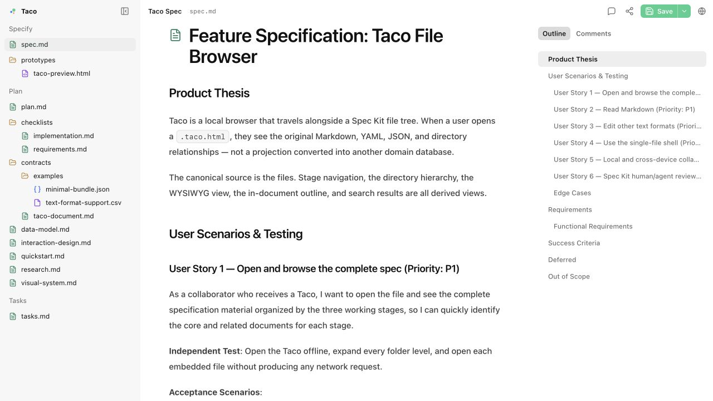
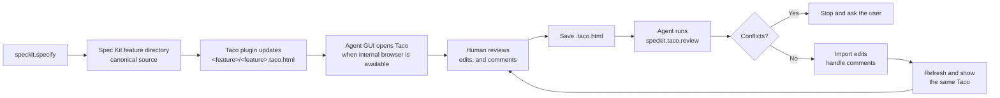

<div align="center">
  
  <h1>Taco</h1>
  <p><strong>English</strong> · <a href="README.zh-CN.md">简体中文</a></p>
  <p>
    <a href="https://github.com/Arcadia822/taco/actions/workflows/ci.yml"></a>
  </p>
  <p>
    <a href="https://taco-spec-en.arcadia822.chatgpt.site">Live demo (English)</a> ·
    <a href="https://taco-spec-zh-cn.arcadia822.chatgpt.site">在线演示（简体中文）</a>
  </p>
  <p><strong>Review, hand off, and manage specs with humans and agents — in one file.</strong></p>
</div>

Taco turns a specification directory into a portable review workspace. A human can open one `.taco.html` file in a browser, read the complete spec, edit the original Markdown, and leave anchored comments. An agent can then import those edits and comments back into the canonical files, handle the feedback, and produce the next review copy.

The file is the handoff. It carries the spec, its directory structure, the reader, the editor, comments, and optional collaboration state. The recipient needs a browser—not a Taco account, hosted workspace, or proprietary requirements database.



Taco includes lightweight support for Spec Kit's directory conventions and is designed for specification-driven development (SDD). It does not require one methodology: its underlying model remains a Markdown file browser and review surface that supports design documents and other directory structures. An Agent can organize Markdown and directories around a team's process, then package that structure as a Taco.

```text
canonical spec directory → one .taco.html → human review → agent sync → canonical spec directory
```

- **Review together:** Humans get a readable interface for editing and anchored comments; agents get structured files and complete review threads.
- **Hand off without setup:** Send one HTML file that opens locally in a modern browser and keeps working offline.
- **Manage the real spec:** Markdown files remain canonical, diffable, and usable by existing repositories, agents, and command-line tools.

## Quickstart: add Taco to a Spec Kit repo

In a repository that already uses Spec Kit, give its Agent this instruction:

```text
Install Taco in this Spec Kit repository and make Taco the default review flow
for future specs. Follow the installation instructions in the Taco repository:
https://github.com/Arcadia822/taco
```

The Agent reads Taco's repository instructions, installs the Spec Kit extension into the current repository, and merges Taco's persistent review policy into the existing project `AGENTS.md`. That plugin installation is Taco: it includes the Agent commands, mandatory lifecycle hooks, offline CLI, self-contained browser shell, and the project rule that keeps Taco current. No second Taco install is required.

After installation, the SDD flow is:



The project-local `AGENTS.md` records this flow for subsequent specs.

## Why open source

Specifications should not be locked inside an account, a server-side workspace, or a proprietary data model. The project follows these boundaries:

- Files are the canonical source.
- A Taco can be opened offline, copied, archived, and shared.
- Markdown remains readable and diffable, and existing agents and command-line tools can continue to process it.
- Both the interface and the transport format can be inspected, modified, and rebuilt.
- Files Taco does not understand remain intact instead of being silently discarded.

The project is licensed under the MIT License. You can study the implementation, change the interaction model, embed your own specification directory, or adapt the single-file container for other local document workflows.

## Current capabilities

- Embed a complete feature directory in one self-contained `.taco.html` file.
- Browse files across specification, planning, and task stages without flattening the actual directory hierarchy.
- Edit canonical Markdown directly with Tiptap instead of maintaining parallel raw and WYSIWYG states.
- Render headings, task lists, compact tables, syntax-highlighted code blocks, line numbers, and copy controls.
- Load a pinned Mermaid build from a CDN only when the current document contains Mermaid; show editable source when offline.
- Switch the right rail between the document outline and comments; the outline follows the document, while comments stay anchored to selected text.
- Synchronize Markdown blocks, comments, members, and cursors across same-origin browser tabs; with an optional relay configured, copies on different devices can collaborate with end-to-end encryption.
- Use a Bento-style sharing panel for editor invitations, read-only copies, member roles, per-device revocation, and access-key reset.
- Edit YAML, JSON, and unknown text formats as source, with live syntax highlighting for JSON.
- Treat HTML and HTM files as specification prototypes, display them as a compact file card, and open them in a separate preview page without executing them inside Taco.
- Search file paths and full text, and open relative Markdown links inside Taco.
- Save a single-file copy, or choose a directory as the Taco file-tree root and write changes back to the Taco file and every sidebar-visible relative path.
- Use the Spec Kit extension to update the same in-directory Taco after every feature-changing SDD stage, safely import human edits, and read comments one at a time.
- When the Agent GUI has an internal browser, automatically open the exact updated Taco for review; otherwise report a clickable local path without uploading the artifact.
- Keep core reading, editing, and same-machine collaboration independent of remote fonts, accounts, and backend APIs. Mermaid rendering and encrypted online collaboration are optional network enhancements triggered explicitly.

## Agent contract

The Quickstart above is the user-facing entry point. [`docs/agents.md`](docs/agents.md) is the machine-facing contract: it contains the installation, verification, packaging, review, conflict, and credential-safety procedures the Agent performs on the user's behalf.

Agent requirements:

- Keep the feature directory canonical. Create and refresh Taco files through the CLI instead of hand-editing the HTML shell.
- Preview every import with `sync --dry-run --json`. Stop on conflicts; `--force` requires explicit authorization for the exact paths.
- Read every open comment and its full message history, then refresh the same Taco so the next reviewer receives the updated spec.
- Treat a live collaboration-enabled Taco as potentially credential-bearing. Do not upload or paste its contents into another service without the user's approval.

## Spec Kit plugin

The plugin lives in `extensions/taco/` and is implemented as a local Spec Kit extension. The Agent installs and verifies it during Quickstart; the user does not need to manage extension commands manually.

Installing the extension installs Taco's complete project-local runtime. Required lifecycle hooks run `speckit.taco.update` after Spec Kit operations that create or modify feature artifacts. The command packages the complete feature directory as `<feature>/<feature>.taco.html`; every refresh targets that same file and preserves its comments. After a human edits or comments in Taco and saves the file, ask the Agent to use:

```text
speckit.taco.review specs/001-example/001-example.taco.html
```

`review` performs a read-only preflight before writing Taco edits back to their original paths. It then hands open comments to the agent with their anchored text, position, and complete message history. Every file includes the SHA-256 baseline captured when it was packaged. If both the source file and the Taco copy changed, the entire sync refuses to write instead of silently choosing one side. Agent-facing installation and CLI details live in [`extensions/taco/README.md`](extensions/taco/README.md).

The packer includes every visible UTF-8 regular file. Its only default exclusions are `*.taco.html` and hidden paths; repeatable `--ignore` parameters add explicit feature-relative path or glob exclusions. Visible unsupported content fails packaging instead of disappearing silently.

After each successful update, an Agent GUI with an internal browser opens and verifies the exact generated Taco automatically. Environments without that capability fall back to a clickable absolute path and must say that the file was not opened.

## Project structure

```text
src/                                  Browser, editor, comments, save, and collaboration runtime
extensions/taco/                      Spec Kit manifest, agent commands, offline CLI, and Taco shell
tests/                                Data model, rendering, interaction, collaboration, and CLI round-trip tests
specs/001-taco-bento-product/         Default Taco content and product specification
specs/002-taco-speckit-plugin/        Installable Spec Kit plugin specification and acceptance flow
server/sync-worker/                    Optional end-to-end encrypted collaboration relay
dist-single/                          Generated single-file Taco
docs/agents.md                        Installation and review workflow for AI agents
vite.config.ts                        Default bundle injection and build configuration
```

The default specification directory is also the project's executable example. Product behavior is in `spec.md`, technical design is in `plan.md`, task state is in `tasks.md`, and the container protocol is in `contracts/taco-document.md`.

## Document routing

`spec.md`, `plan.md`, and `tasks.md` route by filename. Known Spec Kit files and directories follow Taco's built-in conventions. Every other Markdown document uses one of these internal enum declarations:

```md
**Taco scope**: spec
**Taco scope**: plan
**Taco scope**: tasks
```

The declaration must appear at the beginning of the file and use the complete enum value. Taco preserves it in canonical Markdown but hides it from rendered content. See `AGENTS.md` for the complete convention.

## Design principles

1. **Files first:** File content is the only source of truth.
2. **Portable by default:** Core reading, editing, and saving must work offline.
3. **Derived UI:** Stages, directories, the outline, and the search index must not become a second persistent state.
4. **Graceful degradation:** Unknown formats show their source without guessed business semantics.
5. **No invisible rewrite:** Rendered output must never reformat or replace canonical Markdown.
6. **Honest scope:** Same-machine collaboration requires no service. Cross-device collaboration requires an explicitly configured relay. Roles are enforced by file-held cryptographic capabilities; self-declared display names are not presented as account identities.

## Contributing

Issues and pull requests are welcome. See [`CONTRIBUTING.md`](CONTRIBUTING.md) for the complete development workflow, test expectations, and generated-artifact policy. Before submitting a change, run at least:

```bash
npm run check
```

Useful contribution areas include accessibility, editing, more offline text renderers, cross-browser verification, performance, import and export, relay operations, and protocol audits. Enterprise accounts and SSO identities remain a separate boundary; a self-declared display name must not be presented as verified identity.

## Project status

Taco is currently a v0.2 prototype. File browsing, Markdown editing, generic source editing, JSON syntax highlighting, Mermaid, comments, single-file saving, same-origin collaboration, and optional cross-device encrypted relay collaboration are implemented. Structured YAML/JSON editing, version history, accounts, and SSO are not.

Taco v0.2 is a testable prototype, not a production-stability commitment.

## Attribution and license

The single-file build approach was adapted from [Bento](https://github.com/nyblnet/bento). The specification-directory and artifact conventions were inspired by [GitHub Spec Kit](https://github.com/github/spec-kit).

Taco is licensed under the MIT License. See [`LICENSE`](LICENSE) for the complete text and [`THIRD_PARTY_NOTICES.md`](THIRD_PARTY_NOTICES.md) for third-party attribution.
