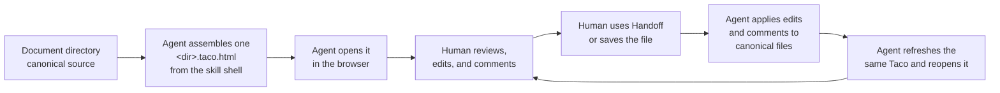

<div align="center">
  
  <h1>Taco</h1>
  <p><strong>English</strong> · <a href="README.zh-CN.md">简体中文</a></p>
  <p>
    <a href="https://github.com/Arcadia822/taco/actions/workflows/ci.yml"></a>
  </p>
  <p>
    <a href="https://taco-spec-en.arcadia822.chatgpt.site">Live demo (English)</a> ·
    <a href="https://taco-spec-zh-cn.arcadia822.chatgpt.site">在线演示（简体中文）</a>
  </p>
  <p><strong>Review, hand off, and manage specs with humans and agents — in one file.</strong></p>
</div>

Taco turns a specification directory into a portable review workspace. A human can open one `.taco.html` file in a browser, read the complete spec, edit the original Markdown, and leave anchored comments. An agent can then import those edits and comments back into the canonical files, handle the feedback, and produce the next review copy.

The file is the handoff. It carries the spec, its directory structure, the reader, the editor, comments, and optional collaboration state. The recipient needs a browser—not a Taco account, hosted workspace, or proprietary requirements database.

Taco is built with gratitude to [Bento](https://github.com/nyblnet/bento), the office suite that fits in a file. Bento showed that a complete creative workspace could travel as one portable document; Taco carries that idea into specification review.


Taco includes lightweight support for Spec Kit's directory conventions and is designed for specification-driven development (SDD). It does not require one methodology: its underlying model remains a Markdown file browser and review surface that supports design documents and other directory structures. An Agent can organize Markdown and directories around a team's process, then package that structure as a Taco.

```text
canonical spec directory → one .taco.html → human review → agent sync → canonical spec directory
```

- **Review together:** Humans get a readable interface for editing and anchored comments; agents get structured files and complete review threads.
- **Hand off without setup:** Send one HTML file that opens locally in a modern browser and keeps working offline.
- **Manage the real spec:** Markdown files remain canonical, diffable, and usable by existing repositories, agents, and command-line tools.

## Quickstart: install Taco from this repository

Point your Agent at this repository:

```text
Install Taco in this repository and make Taco the default review flow
for future specs. Follow the installation instructions in the Taco repository:
https://github.com/Arcadia822/taco
```

The Agent reads Taco's repository instructions and performs the default **CLI-free skill installation**: it installs the complete `skills/taco/` directory (agent guide, production shell, optional references and reader script, and document examples) into its skill location. That is the whole installation: from then on the Agent assembles `.taco.html` review files from the skill's own shell in any directory, fully offline, with no npm package, no CLI, and no build. Optional deeper integrations — Spec Kit extension commands/hooks/policy for project-level wiring, or `taco-cli` for cloud publishing (TacoHub/Tacobin) — are separate, explicitly requested steps described in [`docs/agent-installation.md`](docs/agent-installation.md).

Checkpoint use follows the user's and project's review requirements. The bundled `spec/` SDD graph is an example to adapt, not a default stage plan or a required destination for generated Taco files. Agents load its detailed protocol reference only when working with Checkpoints; a normal review does not need one.

After installation, the review loop needs no further setup:



The Agent copies the skill's shell, writes the document into its data block, and leaves every other file in the directory untouched. Because the Taco carries its own `docId`, comment threads, and sidebar navigation, each refresh preserves them: the next reviewer reopens the same document with their threads intact.

An installation that also wires Taco into a Spec Kit project is a separate, explicitly requested step; the optional extension adds commands, hooks, and project policy but no longer sits on the default path.

## Why open source

Specifications should not be locked inside an account, a server-side workspace, or a proprietary data model. The project follows these boundaries:

- Files are the canonical source.
- A Taco can be opened offline, copied, archived, and shared.
- Markdown remains readable and diffable, and existing agents and command-line tools can continue to process it.
- Both the interface and the transport format can be inspected, modified, and rebuilt.
- Files Taco does not understand remain intact instead of being silently discarded.

The project is licensed under the MIT License. You can study the implementation, change the interaction model, embed your own specification directory, or adapt the single-file container for other local document workflows.

## Current capabilities

- Package a complete specification directory into one portable `.taco.html` file that opens in a browser and works offline.
- Browse, search, and edit the canonical Markdown and text files while preserving their real directory structure.
- Review specs with anchored comment threads, including in-place editing of your own messages and tombstone deletion of individual messages without removing their replies; then save an updated Taco or write the changes back to the original directory.
- Collaborate in real time on the same machine or across devices with encrypted sharing, editor and reader copies, and access controls.
- Integrate with Spec Kit, optionally and on explicit request, to keep each feature's Taco current and safely import human edits and comments with conflict detection.

## Agent installation

The Quickstart above is the user-facing entry point. [`docs/agent-installation.md`](docs/agent-installation.md) is the machine-facing installation and review guide for the Agent acting on the user's behalf. Contributor instructions for Agents working in this repository remain in [`AGENTS.md`](AGENTS.md).

Agent requirements:

- Keep the reviewed directory canonical. The `.taco.html` is a transport: copy the skill's `taco-shell.html`, then write the `taco/files` v1 bundle JSON into its `#taco-document` block, preserving `docId`, comments, navigation, and any Checkpoint graph and statuses across refreshes. Only that data block and the escaped HTML `<title>` are agent-writable; never hand-edit the rest of the shell.
- Open the generated file in the user's browser whenever the host permits local `file://` navigation, and report which of `presented as a clickable file`, `opened`, or `opened and verified` actually happened. A headless load is internal evidence and is never reported as user-visible presentation.
- Take the review back through either channel: the browser's **Handoff** action, or the reviewer's saved `.taco.html`. Handoff copies the text diff since the last save plus the open comment threads, and does not require saving; the saved-file channel does. If neither arrived, say so instead of importing content you never received.
- Preserve all existing bundle fields on every refresh, including `checkpoints` when present; never fabricate a comment, a hash, or a verification claim; never delete a canonical file because it is absent from the bundle.
- Treat a live collaboration-enabled Taco as potentially credential-bearing. Do not upload or paste its contents into another service without the user's approval.

## Optional Spec Kit plugin

The plugin lives in `extensions/taco/` and is implemented as a local Spec Kit extension. It is **optional and explicitly requested**: it adds project-level wiring — two agent commands, lifecycle hooks, an offline CLI, and a persistent project policy — to one initialized Spec Kit project. The skill installation above is complete without it, and the skill workflow never needs it.

Installing the extension adds Taco's complete project-local runtime to that one project. Required lifecycle hooks run `speckit.taco.update` after Spec Kit operations that create or modify feature artifacts. The command packages the complete feature directory as `<feature>/<feature>.taco.html`; every refresh targets that same file and preserves its comments. After a human edits or comments in Taco, ask the Agent to use the browser's **Handoff**, or have them save the file and use:

```text
speckit.taco.review specs/001-example/001-example.taco.html
```

`review` reports conflicts instead of overwriting them. It resolves every changed path against the reviewed `root` and rejects absolute paths, `..`, backslashes, and anything that escapes the feature directory. It then compares the received content with the content the reviewer actually reviewed — the packed baseline, using `sourceHash` when the bundle carries one — and if the canonical file changed since packaging, or a diff does not apply cleanly, it reports that specific conflict with the diff rather than writing. Agent-facing installation and CLI details live in [`extensions/taco/README.md`](extensions/taco/README.md).

The stricter all-or-nothing rule belongs to the extension's optional `sync` CLI utility: it records a SHA-256 baseline for every packed file and refuses every write when both the canonical file and the Taco copy changed since packaging. Neither behavior is applied automatically on the skill's offline path — when a review arrives through Handoff or a saved file with no CLI in the loop, the Agent performs the same comparison itself and stops on any change it cannot attribute.

The packer includes every visible UTF-8 regular file plus validated local PNG assets up to 10 MiB. PNGs are embedded for offline Markdown rendering and preserved as binary data during review round trips. Its only default exclusions are `*.taco.html` and hidden paths; repeatable `--ignore` parameters add explicit feature-relative path or glob exclusions. Visible unsupported content fails packaging instead of disappearing silently.

After each successful update, the Agent presents the exact generated Taco as a native clickable local file, and opens it in the user's browser whenever the host permits local HTML navigation. In Codex, the user click opens it in Browser; the Agent does not attempt autonomous `file://` navigation. A headless boot check is internal evidence and is never reported as user-visible presentation.

## Project structure

```text
src/                                  Browser, editor, comments, save, and collaboration runtime
skills/taco/                          Installable Taco skill: guide, shell, routed references, script, and examples
extensions/taco/                      Optional Spec Kit manifest, agent commands, offline CLI, and project policy
examples/checkpoint-scroll/           Standalone dense Checkpoint demo; not a shipped template
tests/                                Data model, rendering, interaction, collaboration, and CLI round-trip tests
specs/001-taco-bento-product/         Default Taco content and product specification
specs/002-taco-speckit-plugin/        Installable Spec Kit plugin specification and acceptance flow
server/sync-worker/                    Optional end-to-end encrypted collaboration relay
docs/agent-installation.md            Agent installation and review workflow
AGENTS.md                             Instructions for Agents contributing in this repository
CONTRIBUTING.md                       Contributor development and validation guide
vite.config.ts                        Default bundle injection and build configuration
```

The default specification directory is also the project's executable example. Its `README.md` mirrors this project README and opens first as the overview. Product behavior is in `spec.md`, technical design is in `plan.md`, task state is in `tasks.md`, and the container protocol is in `contracts/taco-document.md`.

## Document routing and navigation

By default, a feature-root `README.md` routes to Specify and opens first; `spec.md` is the fallback when no README exists. When a Taco contains a top-level `navigation` manifest, files are grouped and ordered directly according to its declarations, and undeclared files appear under Unassigned. You can also organize groups, drag files, and set entry documents directly in the sidebar during review. In unconfigured Spec Kit trees, `spec.md`, `plan.md`, and `tasks.md` remain the core stage files, known convention paths such as `contracts/` and `checklists/` route with them, and every other document appears under Unassigned until you group it with the Category control in the document header.

Classification is a Taco capability rather than a document property: no frontmatter key routes a file, and the deprecated `taco_scope` property is no longer read. Taco presents all leading YAML frontmatter as an Obsidian-style property editor while preserving it in canonical Markdown. New specs store their title in YAML and begin the body at H2 instead of repeating the title as H1. See `AGENTS.md` for the complete convention.

## Design principles

1. **Files first:** File content is the only source of truth.
2. **Portable by default:** Core reading, editing, and saving must work offline.
3. **Derived UI:** Stages, directories, the outline, and the search index must not become a second persistent state.
4. **Graceful degradation:** Unknown formats show their source without guessed business semantics.
5. **No invisible rewrite:** Rendered output must never reformat or replace canonical Markdown.
6. **Honest scope:** Same-machine collaboration requires no service. Cross-device collaboration requires an explicitly configured relay. Roles are enforced by file-held cryptographic capabilities; self-declared display names are not presented as account identities.

## Contributing

Issues and pull requests are welcome. See [`CONTRIBUTING.md`](CONTRIBUTING.md) for the complete development workflow, test expectations, and generated-artifact policy. Before submitting a change, run at least:

```bash
npm run check
```

Useful contribution areas include accessibility, editing, more offline text renderers, cross-browser verification, performance, import and export, relay operations, and protocol audits. Enterprise accounts and SSO identities remain a separate boundary; a self-declared display name must not be presented as verified identity.

## Project status

Taco is currently a v0.3 prototype. File browsing, Markdown editing, YAML frontmatter properties, generic source editing, JSON syntax highlighting, Mermaid, comments, single-file saving, same-origin collaboration, and optional cross-device encrypted relay collaboration are implemented. Standalone structured YAML/JSON editing, version history, accounts, and SSO are not.

Taco v0.3 is a testable prototype, not a production-stability commitment.

## License and attribution

The specification-directory and artifact conventions were inspired by [GitHub Spec Kit](https://github.com/github/spec-kit).

Taco is licensed under the MIT License. See [`LICENSE`](LICENSE) for the complete text and [`THIRD_PARTY_NOTICES.md`](THIRD_PARTY_NOTICES.md) for third-party attribution.
