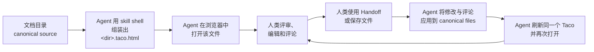

<div align="center">
  
  <h1>Taco</h1>
  <p><a href="README.md">English</a> · <strong>简体中文</strong></p>
  <p>
    <a href="https://github.com/Arcadia822/taco/actions/workflows/ci.yml"></a>
  </p>
  <p>
    <a href="https://taco-spec-zh-cn.arcadia822.chatgpt.site">在线演示（简体中文）</a> ·
    <a href="https://taco-spec-en.arcadia822.chatgpt.site">Live demo (English)</a>
  </p>
  <p><strong>让人与 Agent 在一个文件里共同审阅、传递和管理 spec。</strong></p>
</div>

Taco 把规格目录变成一个可携带的评审工作区。人可以在浏览器中打开一个 `.taco.html` 文件，阅读完整 spec、直接编辑原始 Markdown，并留下锚定到具体文本的评论；Agent 随后可以把修改与评论安全导回 canonical files，处理反馈，再生成下一轮评审文件。

这个文件本身就是交接物。它同时携带 spec、真实目录结构、阅读器、编辑器、评论和可选的协作状态。接收者只需要浏览器，不需要 Taco 账号、服务端 workspace 或专有需求数据库。

Taco 在此向 [Bento](https://github.com/nyblnet/bento)——“装进一个文件的办公套件”——致敬。Bento 证明了完整的创作工作区可以随一个可携带文件同行；Taco 将这一理念带入规格评审。


Taco 对 Spec Kit 的目录约定做了轻量集成，适用于规格驱动开发（SDD）流程，但不要求用户采用某一种方法。它的底层模型仍是 Markdown 文件浏览与评审界面，支持 design 文档和其他目录结构。Agent 可以按照团队的流程组织 Markdown 与目录，再把这种结构打包成 Taco。

```text
canonical spec directory → 一个 .taco.html → 人类评审 → Agent 同步 → canonical spec directory
```

- **共同审阅**：人获得适合阅读、直接编辑和锚定评论的界面；Agent 获得结构化文件与完整评论线程。
- **无需配置即可传递**：只发送一个 HTML 文件，现代浏览器可以本地打开，离线时仍可工作。
- **管理真实 spec**：Markdown 文件继续保持 canonical、可 diff，并能被现有仓库、Agent 和命令行工具处理。

## Quickstart：从本仓库安装 Taco

把下面的指令交给你的 Agent：

```text
在当前仓库中安装 Taco，并让后续 spec 默认使用 Taco 评审流程。
按照 Taco repo 中的安装说明执行：
https://github.com/Arcadia822/taco
```

Agent 会读取 Taco repo 中的说明，执行默认的 **CLI-free skill 安装**：把完整的 `skills/taco/` 目录（Agent 指南、生产 shell、按需加载的参考文档与读取脚本、文档示例）安装到自己的 skill 目录。这就是完整安装；此后 Agent 可以在任意目录用 skill 自带的 shell 组装 `.taco.html` 评审文件，完全离线，不需要 npm 包、CLI 或任何构建。更深入的集成 —— 用于项目级接线的 Spec Kit extension 命令/hooks/policy，或用于云端发布（TacoHub/Tacobin）的 `taco-cli` —— 都属于需要显式请求的独立步骤，详见 [`docs/agent-installation.md`](docs/agent-installation.md)。

是否使用 Checkpoint 取决于用户和项目的评审要求。随 skill 提供的 `spec/` SDD 阶段图只是可改写的示例，不是默认阶段方案，也不决定生成的 Taco 要存在哪里。只有处理 Checkpoint 时才需要加载对应的详细协议参考；普通评审不必设置 Checkpoint。

安装之后，评审闭环不需要额外配置：



Agent 只复制 skill 的 shell、把文档写入其数据块，目录中的其他文件不受影响。Taco 自带 `docId`、评论线程和侧栏导航，因此每次刷新都会保留这些内容：下一位评审者重新打开的是同一个文档，讨论线程仍然完整。

把 Taco 接入 Spec Kit 项目是另一个需要显式请求的步骤；可选 extension 提供命令、hooks 和项目政策，但已不在默认路径上。

## 为什么开源

规格文档不应该被锁在某个账号、服务端工作区或专有数据模型中。项目遵循以下边界：

- 文件是 canonical source。
- 一个 Taco 可以离线打开、复制、归档和分享。
- Markdown 保持可读、可 diff，也能继续被现有 Agent 和命令行工具处理。
- UI 和运输格式都可以被检查、修改和重新构建。
- 未被 Taco 理解的文件仍然保留原文，而不是被静默丢弃。

项目采用 MIT License。你可以研究实现、修改交互、嵌入自己的规格目录，或将单文件容器用于其他本地文档场景。

## 当前能力

- 将完整规格目录打包成一个可携带的 `.taco.html` 文件，在浏览器中打开并离线使用。
- 在保留真实目录结构的同时，浏览、搜索和编辑 canonical Markdown 与其他文本文件。
- 通过锚定评论线程评审规格，可原位编辑自己的消息，也可将单条消息删除为保留回复的占位记录；随后保存更新后的 Taco，或把修改写回原始目录。
- 支持同机或跨设备实时协作，并提供加密分享、编辑与只读副本及访问控制。
- 可选地（需显式请求）集成 Spec Kit，持续更新每个 feature 的 Taco，并通过冲突检测安全导入人类修改与评论。

## Agent 安装说明

上面的 Quickstart 是面向用户的入口；[`docs/agent-installation.md`](docs/agent-installation.md) 是供 Agent 代替用户执行安装和评审的操作说明。Agent 在本仓库内参与开发时，仍遵循 [`AGENTS.md`](AGENTS.md) 中的 contributor 工作规则。

Agent 需要遵守：

- 被评审的目录始终是 canonical source。`.taco.html` 只是运输载体：复制 skill 的 `taco-shell.html`，再把 `taco/files` v1 bundle JSON 写入其 `#taco-document` 数据块，并在每次刷新时保留 `docId`、comments、navigation，以及已有的 Checkpoint 图和状态。只有该数据块和转义后的 HTML `<title>` 可写；不要手工修改其余 shell。
- 当宿主允许本地 `file://` 导航时，用用户的浏览器打开生成的文件，并如实报告 `presented as a clickable file`、`opened`、`opened and verified` 三者中真正发生的一项。headless 加载只是内部证据，不能当作面向用户的可视化展示。
- 通过任一渠道取回评审结果：浏览器的 **Handoff**，或评审者保存后的 `.taco.html`。Handoff 复制的是自上次保存以来的文本 diff 与 open comment，不要求先保存；保存文件这一渠道则必须先保存。两者都没有收到时，如实说明，不要导入并未真正获得的内容。
- 每次刷新都保留所有已有 bundle 字段，包括存在时的 `checkpoints`；不得编造评论、哈希或验证结论；不得因为某个文件不在 bundle 中就删除 canonical 文件。
- 启用在线协作的 Taco 可能携带访问凭据。未经用户允许，不要把其内容上传或粘贴到其他服务。

## 可选 Spec Kit plugin

Plugin 位于 `extensions/taco/`，以本地 Spec Kit extension 的形式实现，是**可选的、需要显式请求**的项目级接线：它向某一个已初始化的 Spec Kit 项目提供两个 Agent 命令、生命周期 hooks、离线 CLI 和持久项目政策。上面的 skill 安装本身就是完整安装，skill 工作流从不依赖它。

安装 extension 会把 Taco 的完整项目内运行时加入这一个项目。强制生命周期 hooks 会在创建或修改 feature artifact 的 Spec Kit 操作后运行 `speckit.taco.update`。它把完整 feature directory 打包为 `<feature>/<feature>.taco.html`，后续始终刷新同一个文件并保留评论。人类在 Taco 中编辑或添加评论后，可以让 Agent 使用浏览器的 **Handoff**，或先保存文件再使用：

```text
speckit.taco.review specs/001-example/001-example.taco.html
```

`review` 遇到冲突时只报告，不覆盖。它会把每个改动路径相对被评审的 `root` 解析，并拒绝绝对路径、`..`、反斜杠以及任何越出 feature directory 的路径；随后把收到内容与评审者当时真正看到的内容（即打包基线，bundle 带 `sourceHash` 时以它为准）比较。如果 canonical 文件在打包后发生变化，或某个 diff 无法干净应用，它会带 diff 报告这一具体冲突，而不是写入。面向 Agent 的安装与 CLI 细节见 [`extensions/taco/README.md`](extensions/taco/README.md)。

更严格的“全有或全无”规则属于 extension 的可选 `sync` CLI 工具：它为每个打包文件记录 SHA-256 基线，当 canonical 文件与 Taco 副本自打包后都发生变化时，拒绝任何写入。这两条都不是 skill 离线路径上自动生效的行为 —— 当评审通过 Handoff 或保存文件到达、链路中没有 CLI 时，由 Agent 自己完成同样的比对，并在遇到无法归因的改动时停止。

打包器包含所有可见 UTF-8 普通文件，以及单个不超过 10 MiB、验证通过的本地 PNG 资源。PNG 会嵌入 Taco 以供 Markdown 离线渲染，并在评审往返过程中按二进制数据原样保留。唯一默认排除项是 `*.taco.html` 和隐藏路径；可重复的 `--ignore` 参数用于增加 feature-relative 路径或 glob 排除。其他可见但不受支持的内容会让打包明确失败，不会被静默丢弃。

每次 update 成功后，Agent 都会把对应 Taco 作为原生、可点击的本地文件展示，并在宿主允许本地 HTML 导航时用用户的浏览器打开它。在 Codex 中，由用户点击后交给 Browser 打开；Agent 不会尝试自主导航到 `file://`。headless 启动检查只是内部证据，不会当作面向用户的可视化展示。

## 项目结构

```text
src/                                  浏览器、编辑器、评论、保存与协作运行时
skills/taco/                          可安装的 Taco skill：指南、shell、按需加载的参考文档、脚本与示例
extensions/taco/                      可选的 Spec Kit manifest、Agent 命令、离线 CLI 与项目政策
examples/checkpoint-scroll/           独立的大型 Checkpoint 演示；不作为安装模板发布
tests/                                数据模型、渲染、交互、协作和 CLI 往返测试
specs/001-taco-bento-product/         默认 Taco 与产品规格
specs/002-taco-speckit-plugin/        可安装 Spec Kit plugin 规格与验收流程
server/sync-worker/                    可选的端到端加密协作 relay
docs/agent-installation.md            面向 Agent 的安装与评审流程
AGENTS.md                             Agent 在本仓库参与贡献时的工作规则
CONTRIBUTING.md                       Contributor 开发与验证指南
vite.config.ts                        默认 bundle 注入与构建配置
```

默认规格目录同时是项目的可执行示例。其中的 `README.md` 与项目 README 内容一致，并作为概览首先打开。产品行为写在 `spec.md`，技术方案写在 `plan.md`，任务状态写在 `tasks.md`，容器协议位于 `contracts/taco-document.md`。

## 文档路由与侧栏导航

默认情况下，功能目录根部的 `README.md` 会进入 Specify 并默认打开；没有 README 时回退到 `spec.md`。当 Taco 包含顶层 `navigation` 清单时，侧栏直接根据声明展示自定义分组与排序，未声明的文件自动归入未分配区；在评审页面中还可直接增删分组、拖拽移动文件以及设定主入口。在无配置的 Spec Kit 目录中，`spec.md`、`plan.md` 和 `tasks.md` 仍是核心阶段文件，`contracts/`、`checklists/` 等约定路径随其归入对应阶段，其余文档一律先进入未分配区，直到评审者用文档头部的 Category 控件为其分组。

分类是 Taco 自身的能力，而不是文档属性：没有任何 frontmatter 键会决定文件路由，已废弃的 `taco_scope` 属性也不再被读取。Taco 会用类似 Obsidian 的属性编辑器展示开头的 YAML frontmatter，同时保留 canonical Markdown。新 spec 把标题写入 YAML，正文从 H2 开始，不再用 H1 重复标题。详细约定见 `AGENTS.md`。

## 设计原则

1. **Files first**：文件内容是唯一事实来源。
2. **Portable by default**：核心阅读、编辑和保存能力必须离线工作。
3. **Derived UI**：阶段、目录、Outline 和搜索索引不成为第二份持久化状态。
4. **Graceful degradation**：未知格式显示源码，不猜测业务语义。
5. **No invisible rewrite**：渲染结果不能反向格式化或替换用户的 canonical Markdown。
6. **Honest scope**：同机协作无需服务；跨设备协作需要用户显式配置 relay。角色由文件内密码学能力执行，不把自填显示名描述为账号身份。

## 参与贡献

欢迎提交 issue 和 pull request。完整的开发流程、测试要求和生成物规则见 [`CONTRIBUTING.md`](CONTRIBUTING.md)。提交前至少运行：

```bash
npm run check
```

适合贡献的方向包括可访问性、编辑器体验、更多离线文本渲染器、跨浏览器验证、性能、导入导出、relay 运维和协议审计。企业账号与 SSO 身份仍是独立边界，不能把自填显示名包装成已验证身份。

## 项目状态

Taco 当前处于 v0.3 原型阶段。文件浏览、Markdown 编辑、YAML frontmatter 属性、通用源码编辑、JSON 语法高亮、Mermaid、评论、单文件保存、同源协作和可选的跨设备加密 relay 已经实现；独立 YAML/JSON 文件的结构化编辑、版本历史、账号与 SSO 仍未实现。

Taco v0.3 是可运行、可测试的原型，不构成生产稳定性承诺。

## 许可与来源

规格目录与产物习惯参考 [GitHub Spec Kit](https://github.com/github/spec-kit)。

Taco 使用 MIT License，完整许可文本位于仓库根目录的 [`LICENSE`](LICENSE) 文件。第三方归属见 [`THIRD_PARTY_NOTICES.md`](THIRD_PARTY_NOTICES.md)。
