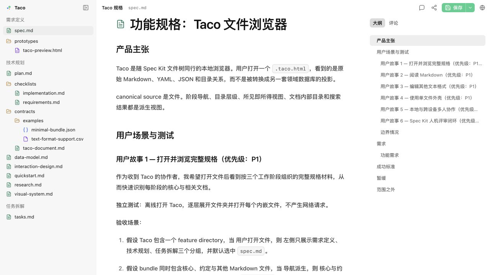
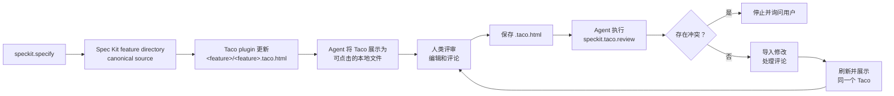

<div align="center">
  
  <h1>Taco</h1>
  <p><a href="README.md">English</a> · <strong>简体中文</strong></p>
  <p>
    <a href="https://github.com/Arcadia822/taco/actions/workflows/ci.yml"></a>
  </p>
  <p>
    <a href="https://taco-spec-zh-cn.arcadia822.chatgpt.site">在线演示（简体中文）</a> ·
    <a href="https://taco-spec-en.arcadia822.chatgpt.site">Live demo (English)</a>
  </p>
  <p><strong>让人与 Agent 在一个文件里共同审阅、传递和管理 spec。</strong></p>
</div>

Taco 把规格目录变成一个可携带的评审工作区。人可以在浏览器中打开一个 `.taco.html` 文件，阅读完整 spec、直接编辑原始 Markdown，并留下锚定到具体文本的评论；Agent 随后可以把修改与评论安全导回 canonical files，处理反馈，再生成下一轮评审文件。

这个文件本身就是交接物。它同时携带 spec、真实目录结构、阅读器、编辑器、评论和可选的协作状态。接收者只需要浏览器，不需要 Taco 账号、服务端 workspace 或专有需求数据库。

Taco 在此向 [Bento](https://github.com/nyblnet/bento)——“装进一个文件的办公套件”——致敬。Bento 证明了完整的创作工作区可以随一个可携带文件同行；Taco 将这一理念带入规格评审。



Taco 对 Spec Kit 的目录约定做了轻量集成，适用于规格驱动开发（SDD）流程，但不要求用户采用某一种方法。它的底层模型仍是 Markdown 文件浏览与评审界面，支持 design 文档和其他目录结构。Agent 可以按照团队的流程组织 Markdown 与目录，再把这种结构打包成 Taco。

```text
canonical spec directory → 一个 .taco.html → 人类评审 → Agent 同步 → canonical spec directory
```

- **共同审阅**：人获得适合阅读、直接编辑和锚定评论的界面；Agent 获得结构化文件与完整评论线程。
- **无需配置即可传递**：只发送一个 HTML 文件，现代浏览器可以本地打开，离线时仍可工作。
- **管理真实 spec**：Markdown 文件继续保持 canonical、可 diff，并能被现有仓库、Agent 和命令行工具处理。

## Quickstart：在 Spec Kit repo 中引入 Taco

在一个已经使用 Spec Kit 的 repo 中，把下面这条指令交给 Agent：

```text
在当前 Spec Kit repo 中安装 Taco，并让后续 spec 默认使用 Taco 评审流程。
按照 Taco repo 中的安装说明执行：
https://github.com/Arcadia822/taco
```

Agent 会读取 Taco repo 中的说明，把 Spec Kit extension 安装到当前 repo，并将 Taco 的持久评审规则合并进项目现有的 `AGENTS.md`。这套 plugin 安装流程就是 Taco 安装：它同时带来 Agent 命令、强制生命周期 hooks、离线 CLI、自包含浏览器 shell，以及保证 Taco 持续更新的项目规则；不需要第二次安装 Taco。

安装之后，SDD 流程如下：



项目本地 `AGENTS.md` 会为后续 spec 记录这套流程。

## 为什么开源

规格文档不应该被锁在某个账号、服务端工作区或专有数据模型中。项目遵循以下边界：

- 文件是 canonical source。
- 一个 Taco 可以离线打开、复制、归档和分享。
- Markdown 保持可读、可 diff，也能继续被现有 Agent 和命令行工具处理。
- UI 和运输格式都可以被检查、修改和重新构建。
- 未被 Taco 理解的文件仍然保留原文，而不是被静默丢弃。

项目采用 MIT License。你可以研究实现、修改交互、嵌入自己的规格目录，或将单文件容器用于其他本地文档场景。

## 当前能力

- 将完整规格目录打包成一个可携带的 `.taco.html` 文件，在浏览器中打开并离线使用。
- 在保留真实目录结构的同时，浏览、搜索和编辑 canonical Markdown 与其他文本文件。
- 通过锚定评论评审规格，随后保存更新后的 Taco，或把修改写回原始目录。
- 支持同机或跨设备实时协作，并提供加密分享、编辑与只读副本及访问控制。
- 集成 Spec Kit，持续更新每个 feature 的 Taco，并通过冲突检测安全导入人类修改与评论。

## Agent 安装说明

上面的 Quickstart 是面向用户的入口；[`docs/agent-installation.md`](docs/agent-installation.md) 是供 Agent 代替用户执行安装和评审的操作说明。Agent 在本仓库内参与开发时，仍遵循 [`AGENTS.md`](AGENTS.md) 中的 contributor 工作规则。

Agent 需要遵守：

- feature directory 始终是 canonical source。通过 CLI 创建和刷新 Taco，不要手改 HTML shell。
- 每次导入前先运行 `sync --dry-run --json`。发现冲突立即停止；只有用户对具体路径明确授权后才能使用 `--force`。
- 阅读每条 open comment 及其完整消息历史，处理后刷新同一个 Taco，供下一轮评审使用。
- 启用在线协作的 Taco 可能携带访问凭据。未经用户允许，不要把其内容上传或粘贴到其他服务。

## Spec Kit plugin

Plugin 位于 `extensions/taco/`，以本地 Spec Kit extension 的形式实现。Agent 会在 Quickstart 中完成安装与验证，用户不需要手动管理 extension 命令。

安装 extension 就会安装 Taco 的完整项目内运行时。强制生命周期 hooks 会在创建或修改 feature artifact 的 Spec Kit 操作后运行 `speckit.taco.update`。它把完整 feature directory 打包为 `<feature>/<feature>.taco.html`，后续始终刷新同一个文件并保留评论。人类在 Taco 中直接编辑或添加评论并保存后，让 Agent 使用：

```text
speckit.taco.review specs/001-example/001-example.taco.html
```

`review` 会先执行只读预检，再把 Taco 中的直接修改写回原始路径，并把开放评论连同锚定文本、位置和完整消息交给 Agent 处理。每个文件携带打包时的 SHA-256 基线；如果原文件与 Taco 两边都发生变化，整次同步拒绝写入，不会悄悄选择一边。面向 Agent 的安装与 CLI 细节见 [`extensions/taco/README.md`](extensions/taco/README.md)。

打包器包含所有可见 UTF-8 普通文件。唯一默认排除项是 `*.taco.html` 和隐藏路径；可重复的 `--ignore` 参数用于增加 feature-relative 路径或 glob 排除。其他可见但不受支持的内容会让打包明确失败，不会被静默丢弃。

每次 update 成功后，Agent 都会把对应 Taco 作为原生、可点击的本地文件展示。在 Codex 中，由用户点击后交给 Browser 打开；Agent 不会尝试自主导航到 `file://`。其他 Agent GUI 只有在明确支持本地 HTML 导航时，才额外自动打开并验证文件。

## 项目结构

```text
src/                                  浏览器、编辑器、评论、保存与协作运行时
extensions/taco/                      Spec Kit manifest、Agent 命令、离线 CLI 与 Taco shell
tests/                                数据模型、渲染、交互、协作和 CLI 往返测试
specs/001-taco-bento-product/         默认 Taco 与产品规格
specs/002-taco-speckit-plugin/        可安装 Spec Kit plugin 规格与验收流程
server/sync-worker/                    可选的端到端加密协作 relay
docs/agent-installation.md            面向 Agent 的安装与评审流程
AGENTS.md                             Agent 在本仓库参与贡献时的工作规则
CONTRIBUTING.md                       Contributor 开发与验证指南
vite.config.ts                        默认 bundle 注入与构建配置
```

默认规格目录同时是项目的可执行示例。其中的 `README.md` 与项目 README 内容一致，并作为概览首先打开。产品行为写在 `spec.md`，技术方案写在 `plan.md`，任务状态写在 `tasks.md`，容器协议位于 `contracts/taco-document.md`。

## 文档路由

功能目录根部的 `README.md` 会进入 Specify 并默认打开；没有 README 时回退到 `spec.md`。`spec.md`、`plan.md` 和 `tasks.md` 仍是三个阶段的核心文件。已知 Spec Kit 文件和目录按内置约定路由；其他 Markdown 可以用 YAML `taco_scope` 属性显式路由：

```md
---
title: '交互设计'
taco_scope: plan
---
```

该属性允许输入文本，但只有 `spec`、`plan` 和 `tasks` 会参与路由。Taco 会用类似 Obsidian 的属性编辑器展示开头的 YAML frontmatter，同时保留 canonical Markdown。新 spec 把标题写入 YAML，正文从 H2 开始，不再用 H1 重复标题。详细约定见 `AGENTS.md`。

## 设计原则

1. **Files first**：文件内容是唯一事实来源。
2. **Portable by default**：核心阅读、编辑和保存能力必须离线工作。
3. **Derived UI**：阶段、目录、Outline 和搜索索引不成为第二份持久化状态。
4. **Graceful degradation**：未知格式显示源码，不猜测业务语义。
5. **No invisible rewrite**：渲染结果不能反向格式化或替换用户的 canonical Markdown。
6. **Honest scope**：同机协作无需服务；跨设备协作需要用户显式配置 relay。角色由文件内密码学能力执行，不把自填显示名描述为账号身份。

## 参与贡献

欢迎提交 issue 和 pull request。完整的开发流程、测试要求和生成物规则见 [`CONTRIBUTING.md`](CONTRIBUTING.md)。提交前至少运行：

```bash
npm run check
```

适合贡献的方向包括可访问性、编辑器体验、更多离线文本渲染器、跨浏览器验证、性能、导入导出、relay 运维和协议审计。企业账号与 SSO 身份仍是独立边界，不能把自填显示名包装成已验证身份。

## 项目状态

Taco 当前处于 v0.2 原型阶段。文件浏览、Markdown 编辑、通用源码编辑、JSON 语法高亮、Mermaid、评论、单文件保存、同源协作和可选的跨设备加密 relay 已经实现；YAML/JSON 结构化编辑、版本历史、账号与 SSO 仍未实现。

Taco v0.2 是可运行、可测试的原型，不构成生产稳定性承诺。

## 许可与来源

规格目录与产物习惯参考 [GitHub Spec Kit](https://github.com/github/spec-kit)。

Taco 使用 MIT License，完整许可文本位于仓库根目录的 [`LICENSE`](LICENSE) 文件。第三方归属见 [`THIRD_PARTY_NOTICES.md`](THIRD_PARTY_NOTICES.md)。
