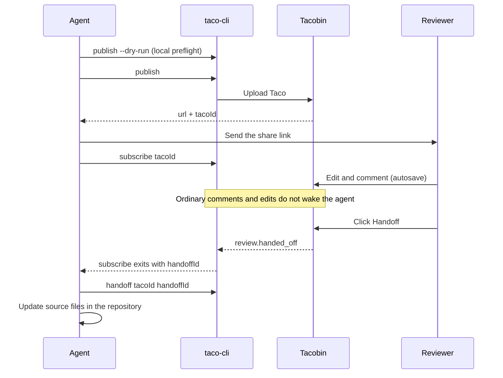

## When to use this

Reviewers are not next to you, or several people need to look at once. The agent publishes the Taco to [Tacobin](../Features/03-Tacobin.md), and reviewers just open a link without installing anything.

## The whole flow



## 1. The agent publishes

```bash
taco-cli publish specs/order-export/order-export.taco.html --host https://taco.arcadia-han.com --dry-run
taco-cli publish specs/order-export/order-export.taco.html --host https://taco.arcadia-han.com
```

The first command is a local preflight that lists the files and size to be published; publish for real only after checking it. Publishing returns two things: a `url` for reviewers and a `tacoId` for the agent.

## 2. The agent starts listening

```bash
taco-cli subscribe <tacoId> --host https://taco.arcadia-han.com
```

This command waits until a reviewer clicks **Handoff**, ignoring ordinary comments and edits in the meantime.

## 3. Reviewers review

A reviewer opens the link and then:

- Enters a name on their first comment;
- Edits and comments with autosave, alongside other reviewers;
- Sees the people and agents currently online in the header avatars.

## 4. A reviewer hands off

When the round is done, they click **Handoff**. Tacobin records a `review.handed_off` event, and `subscribe` exits when it arrives.

If no agent is listening at that moment, no handoff happens; the page shows install and subscribe commands instead.

## 5. The agent processes it

```bash
taco-cli handoff <tacoId> <handoffId> --host https://taco.arcadia-han.com
```

The agent reads the immutable snapshot of the handoff, compares it with the source files, applies the changes, and reports how each comment was handled. If another round is expected, it resumes listening from the confirmed position with `subscribe <tacoId> --after <sequence>`.

## Common misunderstandings

- **Comments and autosave are not a handoff.** If you only comment and never click **Handoff**, the agent receives nothing.
- **Online is not delivered.** An online avatar only means the agent is listening, not that your feedback has been read or handled.
- **A dropped listener loses nothing.** `taco-cli events <tacoId> --after <sequence>` catches up on events, including handoffs made while nobody listened.
- **Revisions need a new publication.** A published version cannot be overwritten online; publish the revised plan again to get a new link.
- **Mind the credentials.** A Taco with online collaboration enabled may carry access credentials; do not pass it around.
