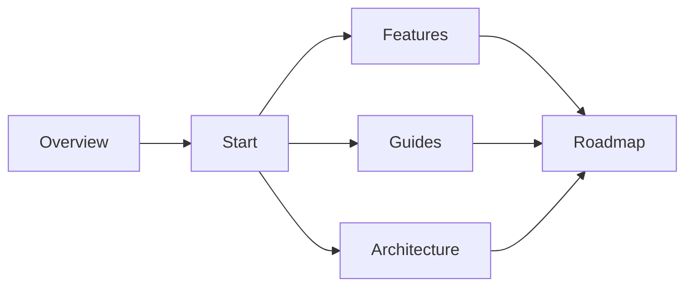

## When you need them

When a topic's documents depend on each other (requirements first, then the design, then the task breakdown) and you want to see at any moment how far along it is and what comes next, add Checkpoints to the Taco.

For one or two documents, or a typo fix, you do not need Checkpoints; a plain Taco is enough.

## A working example

This site uses Checkpoints. Open **Checkpoints** at the top of the sidebar to see the stage graph of this documentation set:



## 1. Define the stages

Checkpoints live in the `checkpoints` field of the Taco's data block: each stage (node) lists the stages it depends on and the documents it contains.

```json
{
  "version": 1,
  "nodes": [
    { "id": "spec", "title": "Requirements", "after": [],
      "documents": [{ "path": "specs/order-export/spec.md",
                      "instruction": "State goals, non-goals, and at least 3 verifiable acceptance criteria" }] },
    { "id": "plan", "title": "Design", "after": ["spec"],
      "documents": [{ "path": "specs/order-export/plan.md" }] }
  ],
  "documents": []
}
```

You rarely write this by hand: tell the agent "move this requirement through requirements → design → tasks" and it generates the definition.

## 2. Four statuses

| Status | Meaning |
| --- | --- |
| To do | Not started |
| In progress | Being written or revised |
| Complete | The author considers it done and waiting for review |
| Frozen | Approved, and the basis for later stages |

Click the status icon in the sidebar or on the Checkpoints page to change it. A stage's status is aggregated from all of its documents: one document in this site's Architecture stage has not started, so the whole stage shows In progress.

Frozen is only a label. It does not lock content and nothing is verified.

## 3. Requirements and documents not yet created

Each document can carry **Requirements** written for its author, whether a person or an agent. Select the document and a **Requirements** tab appears on the right.

A required document that has not been written appears as **Not created**. Find `Roadmap/Next-Phase.md` under Roadmap in this site's sidebar: it does not exist yet, but its requirements are already written. Open it to see them.

Before writing a Checkpoint document, the agent always reads its requirements first.

## 4. Suggested next steps

Taco derives what you can work on next from the stage statuses: once every predecessor of a stage is frozen, that stage becomes available. It is a suggestion, not a gate; any stage can be edited at any time.

## 5. Project conventions

If your team wants every requirement to follow the same stages, save them as a project template in the repository's `.taco/` folder:

- The first line of `.taco/README.md` records whether the team adopts templates;
- `.taco/` holds one or more template Tacos, each describing which requirements it fits.

From then on the agent generates Checkpoints from the template for new requirements, while small changes still skip it. Adoption is the team's call, and the agent suggests it at most once.

## Limits

- Checkpoints do not lock content or block editing across stages;
- After renaming or deleting a required file, the original path shows as Not created again instead of being silently rewritten;
- Statuses travel with the Taco and are not written into document frontmatter.
