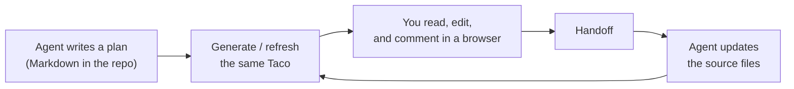

## In one sentence

**The whole design for one topic, in one file.** Humans and agents can both read, edit, and comment on it comfortably, and the file lives in your repository, versioned with your code.

The documentation site you are reading right now is itself a Taco: files on the left, content in the middle, outline and comments on the right, and the Checkpoints view at the top of the sidebar tracks this documentation set's progress. There is no server and no database. Everything is inside a single `.taco.html` file.

## The problem Taco solves

When you design software or products with an agent, plans usually move like this: the agent writes a set of Markdown files in the repository, and you either open them one by one in an editor or paste them into a docs platform to annotate, then retype your feedback into the chat. The result:

- You read in one place and edit in another, so feedback drifts away from the text it refers to;
- Annotations made in a docs platform never make it back to the agent;
- The plan leaves the repository and no longer shares history with the code.

Taco packs every document for one topic into a file you open directly in a browser. You read, edit, and comment on selected text inside it. One click on **Handoff** turns your edits and comments into text an agent can act on. The agent updates the source files in the repository and refreshes the same Taco, keeping the comment threads and the document identity.

## Three things that make Taco different

### One file carries everything

Documents, the real folder structure, a reader, an editor, and comments all live in one file. Send it, commit it, archive it, open it offline. The recipient needs only a browser, not an account.

### Humans and agents are both first-class

You get an interface built for reading: WYSIWYG editing, diagram previews, comments on selected text. The agent gets structured files and complete comment threads: every comment carries its file path and the quoted text, so nobody has to guess what "here" means.

### Files stay the source of truth

The Markdown in your repository is always authoritative. Taco is only the carrier for transport and review. Markdown stays readable and diffable for git, agents, and command-line tools, and Taco never silently rewrites your source while rendering it.

## Where it fits

- **Engineering design** for a task or topic: requirements, approach, APIs, data models, task breakdown;
- **Product design**: PRDs, interaction flows, copy;
- Any document collaboration where the agent writes, a human reviews, and the agent revises.

Taco does not provide real-time multi-user editing, version history, or accounts. For online team review, use [Tacobin](Features/03-Tacobin.md).

## Three parts

| Part | What it is | Read more |
| --- | --- | --- |
| Taco | The single-file review workspace itself | [Taco](Features/01-Taco.md) |
| Taco Skill | Teaches your agent to write, refresh, and read reviews | [Taco Skill](Features/02-Taco-Skill.md) |
| Tacobin | Share links and an online review relay, used with `taco-cli` | [Tacobin](Features/03-Tacobin.md) |

## Design principles

1. **Files first**: file content is the only source of truth.
2. **Portable by default**: one file to open, copy, archive, and share.
3. **Derived UI**: the tree, outline, Checkpoint progress, and search are derived from the files, not a second copy of the data.
4. **No invisible rewrite**: rendering never reformats your Markdown behind your back.
5. **Honest scope**: a local Taco supports review and handoff; it does not pretend to be a real-time collaboration tool.

## Where to go next

- Get started right away: [Quickstart](Start/01-Quickstart.md)
- See what each part does: start with [Taco](Features/01-Taco.md)
- Learn how it is built: [Architecture](Architecture/01-Architecture.md)
