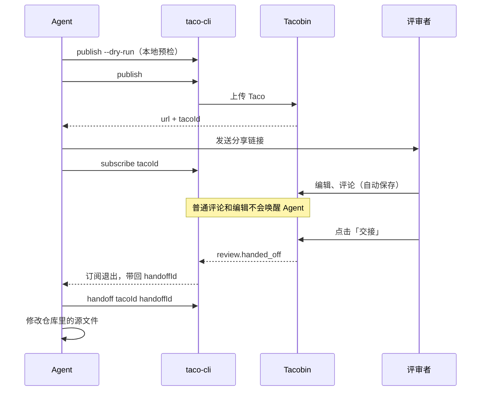

## 适用场景

评审者不在你身边，或者需要好几个人一起看。Agent 把 Taco 发布到 [Tacobin](../功能/03-Tacobin.md)，评审者打开链接即可，不需要安装任何东西。

## 整体流程



## 1. Agent 发布

```bash
taco-cli publish specs/order-export/order-export.taco.html --host https://taco.arcadia-han.com --dry-run
taco-cli publish specs/order-export/order-export.taco.html --host https://taco.arcadia-han.com
```

第一条只在本地预检，列出将公开的文件和大小；确认无误后再正式发布。发布返回两样东西：给评审者的 `url`，以及 Agent 后续使用的 `tacoId`。

## 2. Agent 开始监听

```bash
taco-cli subscribe <tacoId> --host https://taco.arcadia-han.com
```

这条命令会一直等待，直到评审者点「交接」。期间的普通评论和编辑都会被忽略。

## 3. 评审者评审

评审者打开链接：

- 第一次评论时填一个名字；
- 编辑和评论自动保存，多个评审者可以同时参与；
- 页头头像能看到当前在线的人和 Agent。

## 4. 评审者交接

这一轮看完，点「交接」。Tacobin 记录一次 `review.handed_off`，`subscribe` 收到后退出。

如果此时没有 Agent 在监听，交接不会发生，页面会显示安装和订阅命令。

## 5. Agent 处理

```bash
taco-cli handoff <tacoId> <handoffId> --host https://taco.arcadia-han.com
```

Agent 读取这次交接的不可变快照，与源文件比对后修改，并报告每条意见的处理结果。如果预计还有下一轮，再用 `subscribe <tacoId> --after <sequence>` 从已确认的位置继续监听。

## 容易误解的地方

- **评论和自动保存都不是交接。** 只写了评论不点「交接」，Agent 什么都不会收到。
- **在线不等于已送达。** 头像在线只说明 Agent 在监听，不说明意见已经被读到或处理。
- **监听断了也不会丢。** 用 `taco-cli events <tacoId> --after <sequence>` 可以补读事件，没人监听时发生的交接也能找回。
- **改完要重新发布。** 已发布的版本不能在线覆盖；修改后的方案需要重新 `publish`，得到新的链接。
- **注意凭据。** 启用在线协作的 Taco 可能带有访问凭据，不要随意转发。
