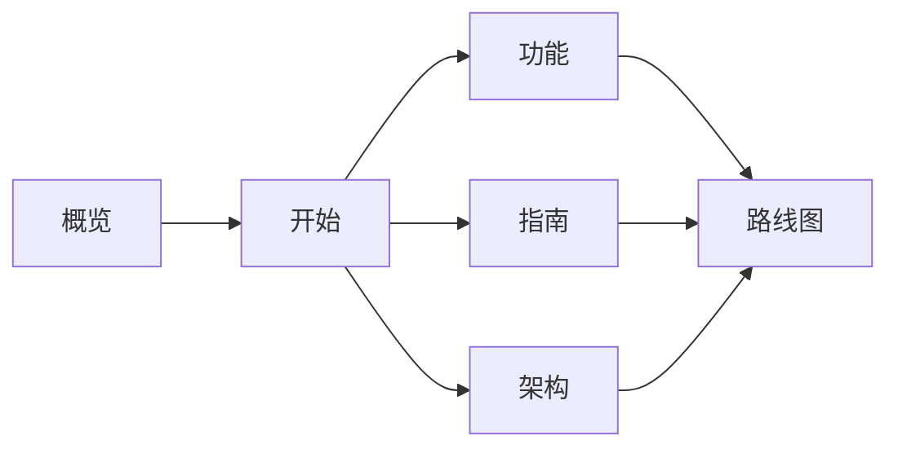

## 什么时候需要

当一个议题的文档之间有先后依赖——先定需求，再做方案，最后拆任务——而你想随时看清「做到哪了、下一步该做什么」，就可以给 Taco 加上检查点。

只有一两篇文档、或者只是改个错字时，不需要检查点，普通 Taco 就够了。

## 看一个现成的例子

本站就在用检查点。点侧栏顶部的「检查点」，可以看到这组文档的阶段图：



## 1. 定义阶段

检查点写在 Taco 数据块的 `checkpoints` 字段里：每个阶段（节点）列出它依赖哪些阶段、包含哪些文档。

```json
{
  "version": 1,
  "nodes": [
    { "id": "spec", "title": "需求", "after": [],
      "documents": [{ "path": "specs/order-export/spec.md",
                      "instruction": "写清目标、非目标和至少 3 条可验证的验收标准" }] },
    { "id": "plan", "title": "方案", "after": ["spec"],
      "documents": [{ "path": "specs/order-export/plan.md" }] }
  ],
  "documents": []
}
```

通常不用手写：告诉 Agent「这个需求按需求 → 方案 → 任务三个阶段推进」，它会生成这段定义。

## 2. 四种状态

| 状态 | 含义 |
| --- | --- |
| 待开始 | 还没动笔 |
| 进行中 | 正在写或正在改 |
| 已完成 | 作者认为写完了，等待评审 |
| 已冻结 | 评审通过，作为后续阶段的依据 |

在侧栏或检查点页面点状态图标即可切换。阶段的状态由其中所有文档汇总得出：本站「架构」里有一篇还没开始，所以整个阶段显示为进行中。

「已冻结」只是一个标记，不会锁定内容，也不做任何校验。

## 3. 要求与未创建的文档

每篇文档可以附带一段「要求」，写给作者——不论是人还是 Agent。选中文档后，右侧会出现「要求」标签页。

被要求、但还没写的文档会显示为「未创建」。在本站侧栏的路线图下找到 `路线图/下一阶段.md`：它还不存在，但已经写好了要求，打开就能看到。

Agent 在写一篇检查点文档之前，总会先读它的要求。

## 4. 下一步建议

Taco 根据各阶段的状态推导出「接下来可以做什么」：一个阶段的所有前置阶段都已冻结，它就进入可推进的范围。这只是建议，不是门禁——任何阶段都可以随时编辑。

## 5. 项目级约定

如果团队希望每个需求都用同一套阶段，可以把它保存成项目模板，放在仓库的 `.taco/` 目录：

- `.taco/README.md` 第一行记录团队是否采用模板；
- `.taco/` 下放一个或多个模板 Taco，每个说明适用于什么样的需求。

之后 Agent 写新需求时会按模板生成检查点；小改动仍然不套模板。是否采用由团队决定，Agent 最多建议一次。

## 边界

- 检查点不锁定内容，不阻止跨阶段编辑；
- 重命名或删除被要求的文件后，原路径会重新显示为「未创建」，不会被悄悄改掉；
- 状态随 Taco 一起交接，不写进文档的 frontmatter。
