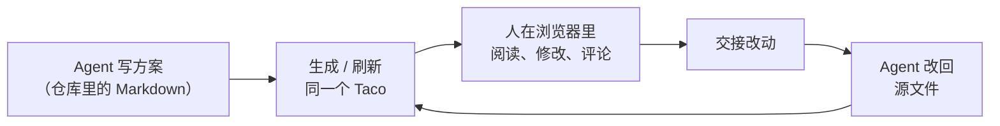

## 一句话

**一个议题的完整设计，一个文件装下。** 人和 Agent 都能顺手地阅读、修改和评论；这个文件放在代码仓库里，跟代码一起做版本管理。

你现在看到的这个文档站，本身就是一个 Taco：左边是目录，中间是正文，右边是大纲和评论，侧栏顶部的「检查点」是这组文档的阶段进度。它没有服务端、没有数据库，全部内容都装在一个 `.taco.html` 文件里。

## Taco 解决什么问题

用 Agent 做开发设计和产品设计时，方案通常这样流转：Agent 在仓库里写出一组 Markdown，人要么在编辑器里逐个打开读，要么复制到文档平台里批注，再把意见手工整理回对话框。结果是：

- 读的地方和改的地方不是同一处，意见与原文脱节；
- 文档平台里的批注，Agent 拿不回来；
- 方案离开了仓库，和代码不再有同一段历史。

Taco 把一个议题的整组文档打包成一个可以直接在浏览器里打开的文件。人在里面读、改、划词评论；点一下「交接改动」，改动和评论就整理成一段 Agent 能直接处理的文本。Agent 改回仓库里的源文件，再刷新同一个 Taco，评论线程和文档身份都保留。

## 三个特点

### 一个文件，带齐所有东西

文档、真实的目录结构、阅读器、编辑器和评论都在一个文件里。发给别人、放进仓库、归档、离线打开都可以；收件人只需要一个浏览器，不需要账号。

### 人和 Agent 都是一等公民

人得到的是适合阅读的界面：所见即所得编辑、流程图预览、划词评论。Agent 得到的是结构化的文件和完整的评论线程：每条意见都带着文件路径和原文引用，不需要猜「这里」指的是哪里。

### 文件才是事实来源

仓库里的 Markdown 始终是权威版本，Taco 只是运输和评审的载体。Markdown 保持可读、可 diff，能被 git、Agent 和命令行工具继续处理；Taco 渲染时不会悄悄改写你的原文。

## 适合什么场景

- 围绕一个任务或议题的**开发设计**：需求、方案、接口、数据模型、任务拆分；
- **产品设计**：PRD、交互流程、文案；
- 任何「Agent 先写、人来审、Agent 再改」的文档协作。

Taco 不做实时多人协作、版本历史和账号体系。需要团队在线评审时，用 [Tacobin](功能/03-Tacobin.md)。

## 三个组成部分

| 部分 | 是什么 | 详见 |
| --- | --- | --- |
| Taco | 单文件评审工作区本身 | [Taco](功能/01-Taco.md) |
| Taco Skill | 让 Agent 会写、会刷新、会读评审结果 | [Taco Skill](功能/02-Taco-Skill.md) |
| Tacobin | 分享链接与在线评审中继，配合 `taco-cli` 使用 | [Tacobin](功能/03-Tacobin.md) |

## 设计原则

1. **Files first**：文件内容是唯一事实来源。
2. **Portable by default**：一个文件即可打开、复制、归档、分享。
3. **Derived UI**：目录、大纲、检查点进度、搜索都是从文件推导出来的，不是第二份数据。
4. **No invisible rewrite**：渲染结果不会反向改写你的 Markdown。
5. **Honest scope**：本地 Taco 支持评审和交接，不假装是实时协作工具。

## 接下来读什么

- 想马上用起来：[快速开始](开始/01-快速开始.md)
- 想知道每个部分能做什么：从 [Taco](功能/01-Taco.md) 开始
- 想了解实现：[技术架构](架构/01-技术架构.md)
