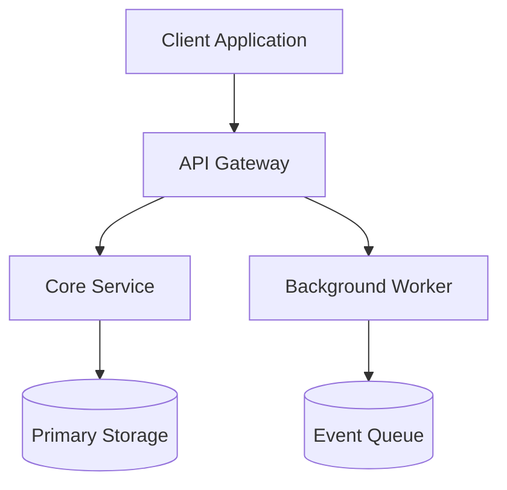

## 1. Executive Summary

[Concise overview of what this system does, what problems it solves, and its business context.]

## 2. High-Level Architecture

## 3. Core Components & Responsibilities

- **Component A**: [Responsibility, scaling properties, dependencies]
- **Component B**: [Responsibility, scaling properties, dependencies]

## 4. Data Flow & Sequence

1. User sends request to API Gateway.
2. Gateway authenticates and forwards payload to Service A.
3. Service A writes state to Primary Storage and emits an event to Queue.

## 5. Key Tradeoffs & Rejected Alternatives

- **Decision 1**: [Chosen approach vs alternatives, reasoning]
- **Decision 2**: [Chosen approach vs alternatives, reasoning]
