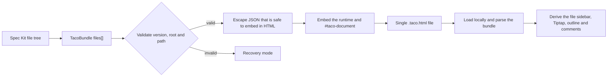

## Container

The release artifact is a single self-contained file:

```text
<name>.taco.html
```

It contains the Taco runtime and a single bundle block:

```html
<script id="taco-document" type="application/taco+json">
{
  "format": "taco/files",
  "version": 1,
  "docId": "taco-product-spec",
  "title": "Taco product specification",
  "root": "specs/001-taco-bento-product",
  "files": [
    {
      "title": "Feature Specification: Taco File Browser",
      "path": "specs/001-taco-bento-product/spec.md",
      "mediaType": "text/markdown",
      "content": "**Feature Directory**: specs/001-taco-bento-product\n",
      "sourceHash": "<sha256-of-content-at-pack-time>"
    }
  ]
}
</script>
```

The JSON is the container protocol, not a product-spec schema. `content` is the file source of truth.

An edit invitation may carry the relay room, AES-GCM key, Owner public key, delegated invite, and CRDT snapshot in `collab`; a read-only copy carries only `access: "reader"` and drops `collab`. The Owner private key is only allowed to stay in the Owner's own Taco. `collab.role: "reader"` in older files is for backward compatibility only and is no longer produced by the share menu.



Saving and reopening both go through the same container path. The rendered HTML, Mermaid SVG, and outline state do not flow back into `files[].content`.

Stage navigation adds no bundle fields. Core files and Spec Kit convention files are identified by relative path; other Markdown declares its membership with a `taco_scope: spec|plan|tasks` YAML property. The property remains canonical Markdown and appears in the document property editor. Invalid text remains preserved but does not route. The directory structure continues to be derived from `path`.

## Invariants

- The block must appear exactly once.
- The bundle `title`'s normalized filename must match the stem of the container `.taco.html`; the HTML `<title>` must be derived from the same bundle title.
- When unpacking in the browser, the user-selected directory is the sidebar file tree root; `files[].path` must have its `${root}/` prefix removed before writing, and the project-level `root` must not be recreated inside the target directory.
- All paths must be UTF-8 relative paths located under `root/`.
- Paths must not be duplicated and must not contain `..`, `.`, empty segments, backslashes, or absolute paths.
- `files[].title` may be omitted; when present it must be a non-empty string. Editing it only changes the display title and must not rewrite `path` or the on-disk filename.
- `files[].sourceHash` may be omitted; a CLI-created Taco must write a 64-character lowercase hexadecimal SHA-256 representing the canonical file content at pack time. Browser edits must not update this value; it is the bilateral conflict baseline for the next Agent sync.
- Every HTML/HTM file must have `files[].sourceUrl`, an absolute `file:` URL with no authority, credentials, query, or fragment whose decoded pathname ends in the validated `files[].path`. Non-HTML files must not carry this field. CLI packaging writes it from the canonical absolute source path; invalid bundles enter Recovery mode instead of receiving a generated `data:` or Blob fallback.
- `pack --from` may accept a legacy Taco whose HTML entry lacks this field solely as migration input; the refreshed output must replace it with the canonical URL before validation or delivery.
- `files[].sourceUrl` is local transport metadata. Taco omits it from collaboration synchronization and from the public Agent file projection.
- `content` must be saved verbatim from the file; the renderer must not write back formatted results.
- A `<` inside a string is safely escaped in the HTML to avoid ending the script block.
- The runtime does not execute bundle content.
- The bundle's core reading and editing depend on no external CDN, font, account, or backend; it connects to the relay specified by `collab.room` only when the user explicitly starts online collaboration.

## Renderer Strategy

| Media type / extension | v0.2 behavior |
|---|---|
| `text/markdown`, `.md` | Tiptap WYSIWYG editing + canonical Markdown serialization |
| `text/html`, `.html`, `.htm` | non-embedded preview card opening the validated canonical `file:` URL in a separate page |
| YAML, `.yaml`, `.yml` | source only |
| JSON, `.json` | source only |
| Other text | source only |

Later renderers are pluggable views and must not change the canonical content.

## Agent Protocol

The v0.2 Agent can only:

- `listFiles()`
- `readFile(path)`
- `search(query)`

Future write capabilities should use file patches: `writeFile`, `applyPatch`. Renaming files is not a protocol capability; parallel domain APIs such as `addRequirement` or `updateTask` must not be reintroduced.

The Spec Kit extension's file-level protocol is provided by the offline CLI:

- `pack <feature-dir>`: read UTF-8 text files, record a `sourceHash`, attach each HTML file's canonical `file:` URL, and create a Taco.
- `sync <taco> --dry-run --json`: before writing to disk, return each file's `created | updated | unchanged | conflict` status and all comments.
- `sync <taco> --json`: write back to canonical paths only when the full pre-check has no conflict; missing files are not deleted.
- `comments <taco> --status open --json`: return comment paths, quotes, line/column, stale status, and messages.

A conflict is defined as: the target canonical file's current hash differs from both the `sourceHash` and the Taco's `content` hash. When any file conflicts, the default sync is all-or-nothing and writes no other file. `--force` is an explicit manual recovery operation and is not part of the automated Agent flow.
