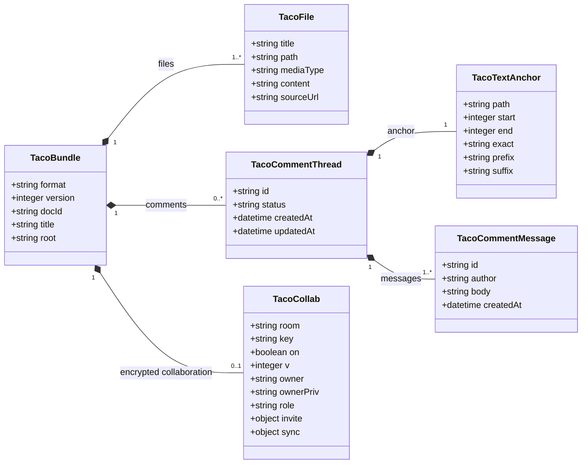

## Principle

Taco v0.2 has only a transport model, no spec domain model. The user stories, requirement numbers, task checkboxes, and success criteria that appear in Markdown remain file content.

The diagram shows only the transport objects that enter the single-file container. Stage navigation, the Tiptap document tree, the in-file outline, and search results are not in this persisted relationship diagram.

## TacoBundle

| Field | Type | Rule |
|---|---|---|
| `format` | literal | `taco/files` |
| `version` | positive integer | currently `1` |
| `docId` | string | the bundle's stable identity |
| `title` | string | the top-bar display name; once normalized it must equal the persisted `.taco.html` filename stem |
| `root` | relative path | the feature directory boundary |
| `files` | `TacoFile[]` | the set of files, sorted by path |
| `comments` | `TacoCommentThread[]?` | optional local comment threads; saved with the Taco file |
| `access` | `reader?` | a mandatory read-only marker for an offline packaged copy |
| `collab` | `TacoCollab?` | an optional room, read key, role credential, and CRDT snapshot; contains no account identity |

## TacoCollab

`room` points to the optional relay, and `key` is the client AES-GCM read capability. An Owner copy keeps `ownerPriv`; an edit invitation keeps only the Owner-signed `invite` delegation; a live viewer keeps only `room`, `key`, `owner`, and `role: reader`. `sync` keeps the version vector and CRDT registers so a reconnecting offline copy can merge instead of overwriting the whole document.

The display name is stored locally by the browser and sent through encrypted presence. It is not an account or a verified identity; device identities in the member list are distinguished by signed public-key fingerprints.

## TacoFile

| Field | Type | Rule |
|---|---|---|
| `title` | string? | an optional in-file display title; must be a non-empty string and must not modify `path` when edited |
| `path` | string | must sit under `root/`; no absolute paths, backslashes, empty segments, `.`, or `..` |
| `mediaType` | string | a content format hint that grants no semantic interpretation |
| `content` | string | the file's raw UTF-8 text |
| `sourceUrl` | string? | required only for HTML/HTM; the canonical absolute `file:` URL whose decoded pathname ends in `path` |

## Derived State

The following is derived only at runtime and is not written to the bundle:

- stage navigation and role grouping
- the in-group directory tree such as `contracts/`
- the current file and viewport state
- Markdown HTML
- the H1–H3 page outline (excluding file metadata titles)
- the search index and results
- file-type badges
- comment selection highlights and the currently active thread

Future task counts, requirement coverage, or readiness may likewise only be parsed from files, and must not become a parallel source of truth.

## Stage Projection

Taco recognizes three core files: `spec.md`, `plan.md`, and `tasks.md`. A feature-root `README.md` enters Specify by convention and is preferred as the opening document, with `spec.md` as the fallback. Known Spec Kit artifacts enter their corresponding stage by path; other Markdown may declare `taco_scope: spec|plan|tasks` in YAML frontmatter and enter the selected stage directly. Other text values remain canonical and visibly invalid but create no custom or extension group.

Both stages and directories are derived from `files[]` and are not written to a second navigation schema.

## Local Comments

Comments use a thread model. A `TacoCommentThread` contains a stable `id`, an `open/resolved` status, timestamps, a message array, and a text anchor:

- `anchor.path`: the file path the comment belongs to; v0.2 does not allow renaming files, so this path does not change when a title is edited.
- `anchor.position.start/end`: a fast lookup range based on the currently rendered text.
- `anchor.quote.exact/prefix/suffix`: a Web Annotation-style quote with context; used to re-anchor after positions become invalid.
- `messages[]`: each message contains a stable ID, a local author name, a body, and a creation time.

Storing both the position and the quote avoids binding comments to the volatile editor DOM. Comments are saved in the bundle and synced through the same CRDT; the collaboration role controls whether comments can be submitted, but does not promote comments into a remote business database.

## Compatibility

- Known version: normal browsing.
- Newer version: read-only browsing when the current runtime can parse the transport fields; must not overwrite.
- Corrupt JSON or an illegal path: Recovery mode.
- HTML/HTM: preserve the original text and require a matching canonical `file:` URL for the new-page prototype preview card.
- Unknown media type: plain-text source.
