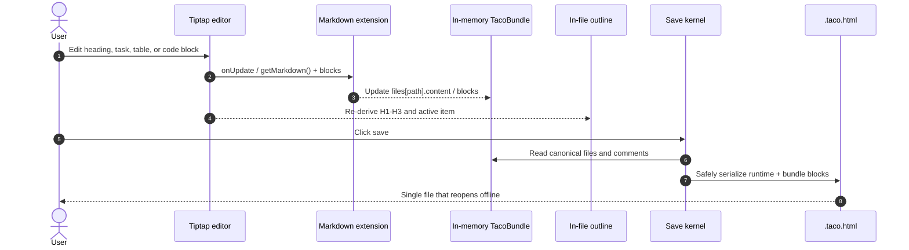

## 1. Mental Model

Taco v0.3 is a small local knowledge base containing one Spec Kit feature directory. The file sidebar is the only global panel; the outline and comments belong to the selected document and share a persistent auxiliary area beneath the workspace Header.

```text
┌──────────────────┬───────────────────────────────────────────────────────┐
│ Taco          ‹  │ Taco title · file path                  Share Save    │
├──────────────────┼───────────────────────────────────┬───────────────────┤
│ files            │ editable Tiptap document         │ [Outline] Comments│
│ folders          │                                   │ document-local    │
│                  │ one ghost-style reading surface   │ auxiliary content │
│ independent      │                                   │ no close control  │
│ scroll area      │                                   │                   │
└──────────────────┴───────────────────────────────────┴───────────────────┘
```

There is no generated Overview page and no dashboard. Opening a Taco prefers the feature-root `README.md` as its authored overview, then falls back to `spec.md` when no README exists.

## 2. Workspace Shell

- Taco first splits the shell into a collapsible file sidebar and a document workspace. The workspace then splits the area beneath its 40px Header into an editable document and a persistent document-local auxiliary area.
- The file sidebar and the workspace each have their own Header. The outline/comments area has a compact row of tabs rather than a global sidebar Header or a close button.
- The left Header contains a precise 24×24px Taco mark and the collapse control. Once collapsed, its reopen icon moves into the workspace Header.
- The workspace Header contains an inline-editable bundle title, followed by the root-relative path of the selected file. Editing the title immediately updates the document and browser title and marks the Taco dirty. The normalized title and the persisted `.taco.html` filename stem are an invariant: after a title change, saving requires a matching new filename rather than overwriting a differently named handle, and a copy gets a matching `-copy` title and filename. To its right are the comments shortcut, the share menu, a Castrel v2-style primary Save split button, and the globe language switcher. The split-button menu offers Save, Save a copy, and Save & unpack to folder. There is no help and no Markdown mode toggle.
- The outline and comments reuse the shared 24px segmented control component. Selecting the Header comments shortcut activates the Comments tab; it does not open or close another global panel.

This follows Castrel's AppShell composition: the outer split first, then the workspace-local composition. Header controls use compact 24px ghost icon buttons.

## 3. Stage Navigation

- Route files into exactly three top-level groups: Requirements, Technical Plan, and Task Breakdown.
- The sidebar contains only Specify, Plan, and Tasks; scoped documents appear directly in their selected stage.
- A feature-root `README.md` enters Specify by convention and is the preferred opening document, so it needs no internal `taco_scope` metadata.
- All `checklists/` files sit under Technical Plan, matching the official Plan → Checklist → Tasks quality-gate order.
- Group titles use secondary text and have no leading icon slot. A centered right chevron appears only on hover or keyboard focus and rotates when expanded.
- Physical folders such as `contracts/` and `checklists/` and custom subdirectories remain navigable. Their leading icon toggles between closed-folder and open-folder states.
- HTML and HTM files are treated as spec prototypes and automatically routed to Specify; they do not need the Markdown-only `taco_scope` metadata.
- The selected file is indicated by text/background, not by color alone.
- The file icon conveys file identity without implying that a format renderer exists.
- Mobile and narrow-screen layouts start with the drawer closed.
- The collapse control lives in the sidebar Header; once closed, an equivalent reopen control appears in the workspace Header.

## 4. Markdown Editor

- Markdown opens directly in Tiptap with the official Markdown extension and stays directly editable. There is no raw/source mode.
- The Markdown viewer has no separate filename title row. The selected root-relative path in the workspace Header provides that context.
- The editor has no persistent formatting toolbar; editing happens directly in the document surface.
- Each Tiptap top-level node gets a stable `data-taco-block-id`. Updates serialize both the canonical Markdown and each block's HTML; the latter is collaboration transport/cache state, not a parallel product domain model.
- H1–H3 populate an untitled, ghost-style outline in the right auxiliary area.
- GFM checkboxes, tables, and fenced-code structure stay readable.
- Only fenced blocks whose language is exactly `mermaid` request the pinned-version cloud renderer and get a diagram preview plus a source/preview toggle. Bash, JSON, and other code blocks stay plain code and never load Mermaid.
- If the Mermaid module fails to load, the preview and zoom controls disappear and the original editable code block stays visible.
- Relative links to bundle files navigate internally.
- External links explicitly open a new browser context.
- Unsupported raw HTML never becomes executable editor content.



## 5. Other Formats

YAML, JSON, and unknown files open directly in the generic source editor. It has no separate Header, no large content padding, no border, no background surface, no tree editor, no validation badge, and no inferred schema. Editing updates the canonical `files[].content` value and the Save dirty state.

JSON uses live syntax highlighting behind the native editing surface. YAML and unknown text keep plain source coloring. Long source lines scroll horizontally instead of wrapping.

HTML and HTM files use a different boundary: near the top of the viewer, a centered single-line card shows only the file icon, the title, and an `Open Preview` action. CLI packaging records the canonical absolute `file:` URL, and the action opens it with `_blank` plus `noopener noreferrer` regardless of the Taco container's location; relative CSS, JavaScript, and image references therefore retain their normal filesystem base. The committed showcase shell uses only the exact `../<project-relative-path>` reference and resolves it to the same canonical `file:` URL at runtime, avoiding machine-specific build output. Missing or mismatched references are rejected before the file enters a valid Taco. Taco never substitutes a `data:` or Blob URL, embeds a prototype in an iframe, or injects it into the current document.

## 6. Search

`⌘/Ctrl+K` opens a dialog that searches relative paths and file text. Selecting a result closes the dialog and opens the file. v0.3 does not rank or index semantic entities.

Search has no persistent Header button; it is a keyboard tool.

## 7. Local and Online Collaboration

- Tabs with the same origin and `docId` can join a local room through `BroadcastChannel`; this path has no server or account dependency.
- The Bento-aligned Share panel handles the per-tab display name, the People roster, role/key fingerprints, live status, share-copy variants, and access control.
- Go Live connects the same CRDT session to the deployment-configured blind relay. Relay configuration stays out of the Share panel. Frames are AES-GCM encrypted; persisted writes are signed by the Owner or a delegated device key.
- Invite to edit creates an Owner-signed delegated copy without the Owner private key. A read-only copy removes the collaboration credentials and cannot receive live updates.
- People groups browser sessions by collaboration public key, so another tab opened from the same owner/editor copy is not presented as a separate Guest.
- The Owner can revoke a device from the People list, or reset the room and key to invalidate every copy previously sent.
- The display name is used for comment attribution, presence avatars, and remote cursor labels, but remains an unverified local claim, not an account identity.
- Presence publishes the file ID, the ProseMirror selection position, and focus state. Only peers focused on the selected file render cursors/selections.
- Document sync uses the Bento-derived CRDT. Stable file/block/comment IDs provide structural identity; block HTML merges through a token RGA, and comments are separate child nodes.
- Heartbeats remove stale peers. A joining copy requests missing operations and can merge a persisted snapshot fork.

- The workspace Header's comment icon activates the Comments tab in the right auxiliary area and shows the number of open threads for the current file.
- Selecting rendered Markdown text shows a transient `Comment on selection` action. Submitting it creates a local thread and activates the Comments tab.
- Open comment anchors use a non-destructive CSS highlight; the editor's document DOM and Markdown are not wrapped or rewritten.
- Threads support replies, resolve/reopen, and deletion.
- Clicking a quote re-anchors from the position plus the exact/prefix/suffix text context, then scrolls to the source selection.
- Comments are part of the canonical Taco bundle and are persisted by Save/Save a copy.

## 8. Responsive Behavior

- `>1080px`: file tree + document + persistent document-local outline/comments area.
- `821–1080px`: the same workspace composition, but with a narrower file sidebar.
- `≤820px`: the file tree becomes a drawer that is closed by default; the document-local auxiliary area stays available.

## 9. Header Tool Items

- Language changes only the shell labels and persists locally. The built-in selection matches Bento: Simplified Chinese, English, Traditional Chinese, Japanese, Spanish, French, German, Italian, and Portuguese. The menu puts Simplified Chinese first and English second; when neither a saved selection nor a browser preference matches, Taco falls back to English.
- Sharing saves a capability-specific Taco copy. The current browser URL is not presented as a cross-device invitation because it does not contain the document.
- Save rewrites or downloads the self-contained Taco artifact, including in-memory Markdown edits; Save a copy never replaces the adopted file handle. A denied directory grant is reported as a missing/denied folder access rather than a completed cancellation.
- Save & unpack to folder treats a user-selected writable directory as the Taco file tree root. It writes the Taco artifact directly there, reconstructs every sidebar-visible root-relative file path there without adding the bundle's project-level `root` prefix, and adopts that Taco file as the target for subsequent Save operations. Files that already exist at those paths are updated; unrelated files are preserved.

## 10. Accessibility

- The file tree is a `nav` using native buttons, lists, `details`, and `summary`.
- The main content is a real `main`, and Markdown produces semantic headings.
- The document outline is a labeled navigation region inside the shared right auxiliary area; comments reuse the same labeled complementary region.
- The file sidebar Header has a control with an explicit accessible name.
- All controls have visible focus and a text label or accessible name.
- Wide tables and source blocks scroll within their own surface.
- Reduced motion disables smooth transitions.
