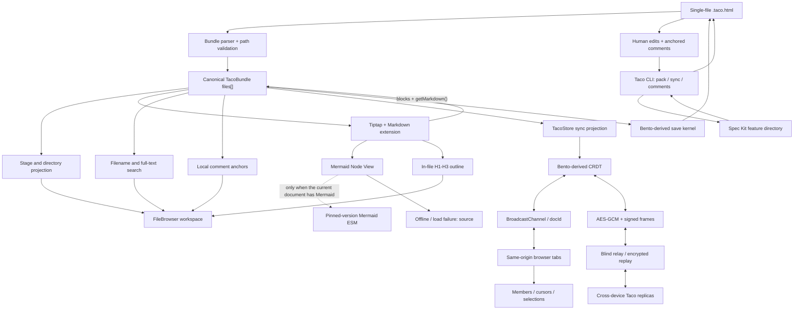

## Overview

Build a self-contained browser for a single Spec Kit feature directory. At build time Vite reads the real directory and injects a generic file bundle. The runtime derives stage projections, edits Markdown as stable Tiptap blocks, and syncs replicas through a Bento-derived CRDT using a local `BroadcastChannel` plus an optional encrypted WebSocket relay.

## Technical Context

- **Language**: TypeScript 5.8
- **Runtime**: browser; optional Cloudflare Worker blind relay for cross-device collaboration
- **Build**: Vite + `vite-plugin-singlefile`
- **Markdown**: Tiptap 3 + the official Markdown extension; canonical output uses `getMarkdown()`
- **Diagrams**: Mermaid 11.16.1, loaded on demand from a pinned CDN ESM address for the current document in strict security mode; falls back to source when offline
- **Sanitization**: DOMPurify
- **Testing**: Vitest + jsdom
- **Storage**: an embedded UTF-8 file bundle; canonical Markdown plus collaboration block/cache state
- **Collaboration**: `BroadcastChannel` locally; AES-GCM WebSocket transport, signed writes, encrypted replay snapshots, and revocation over an optional relay
- **Targets**: modern desktop browsers; responsive reading on narrow screens
- **Constraints**: zero network requests before Mermaid rendering or online collaboration is explicitly requested; no business schema beyond files
- **Spec Kit integration**: a schema v1 extension with a mandatory `after_specify` hook; a standalone Node.js CLI for pack/sync/comment inspection

## Constitution Check

- File content remains the single source of truth: pass.
- Unknown formats fall back to source: pass.
- No account dependency: pass; Mermaid and the self-hosted encrypted relay are optional network enhancements. Display names remain unverified local claims.
- Unsafe Markdown cannot execute: covered by sanitizer tests.
- The current UI offers Markdown WYSIWYG editing plus generic YAML/JSON/text source editing without implying structured-format editing or cloud persistence: requires a browser audit.

## Runtime Architecture



Every UI branch ultimately returns to the same `files[]`. Mermaid never enters the single-file runtime; only the Mermaid Node View of the currently visible document requests the pinned-version cloud ESM. Mermaid SVG, the Tiptap document tree, outline active state, and search results exist only at runtime.

## Project Structure

```text
src/
├── file-browser.ts   # file tree and navigation
├── main.ts           # bundle boot and read-only Agent API
├── model.ts          # transport validation only
├── identity.ts       # per-tab collaboration/comment identity
├── store.ts          # bundle ↔ CRDT projection
├── stage-navigation.ts # derived Specify/Plan/Tasks projection
├── render.ts         # Markdown renderer and heading slugs
├── tiptap-editor.ts  # shared Tiptap extension composition
├── tiptap-code-block.ts # code-block Node View and Mermaid-only preview
├── mermaid.ts        # pinned cloud loader, strict renderer and source fallback
├── styles.css
├── sync/             # Taco CRDT binding, local session and encrypted online transport
└── kernel/           # Bento-derived persistence and generic CRDT engine

server/sync-worker/   # optional Cloudflare Worker relay; ciphertext only

tests/
├── model.test.ts
├── render.test.ts
├── tiptap-editor.test.ts
├── collaboration.test.ts
├── file-browser.test.ts
└── taco-cli.test.ts

extensions/taco/
├── extension.yml    # Spec Kit command and after_specify hook registration
├── commands/        # Agent procedures for create and review
├── bin/taco.mjs     # offline pack, conflict-safe sync and comment inspection
└── assets/          # self-contained Taco runtime shell
```

## Build Flow

1. `vite.config.ts` recursively reads `specs/001-taco-bento-product/`.
2. Each file becomes `{ path, mediaType, content }`, with no semantic parsing.
3. The bundle is injected into `#taco-document`.
4. `vite-plugin-singlefile` inlines the runtime and CSS.
5. The browser parser validates path boundaries before rendering.
6. Stage navigation recognizes core and conventional Spec Kit paths, routes HTML/HTM prototype paths to Specify, then reads the hidden `Taco scope` enum from other Markdown documents; physical subdirectories stay nested inside one of the three default stages.
7. Selecting an HTML file creates a transient `text/html` Blob URL for a semantic new-page preview link; file changes and browser teardown revoke that URL.

## Spec Kit Review Round-Trip

1. The extension's mandatory `after_specify` hook dispatches `speckit.taco.create` after `spec.md` is written.
2. The CLI recursively reads UTF-8 feature files, saves each file's exact content plus a `sourceHash`, and injects the bundle into the packaged Taco shell.
3. Direct human edits change `files[].content`; comments live in the same bundle as separate anchored threads. Saving the Taco is an explicit handoff boundary.
4. `speckit.taco.review` first runs `sync --dry-run --json`. It checks every target path and hash before any write.
5. If a canonical hash differs from both the `sourceHash` and the Taco content hash, the entire sync refuses to write. Otherwise direct edits are written back to their original paths.
6. The Agent reads each open comment from the JSON result, applies actionable feedback to canonical files, then repacks the same Taco with `--from` so threads are preserved and file baselines advance.

## Collaboration Boundary

Markdown editing and persistence continue to operate on the virtual file map. A session fans the same set of CRDT frames out to both the local and online transports. Files carry a symmetric read capability, plus an Owner key, an Owner-signed invitation, or no signing key for viewers. The relay enforces signed writes and revocation while staying blind to document content. Account identity, SSO, and organization policy remain separate deployment concerns.
