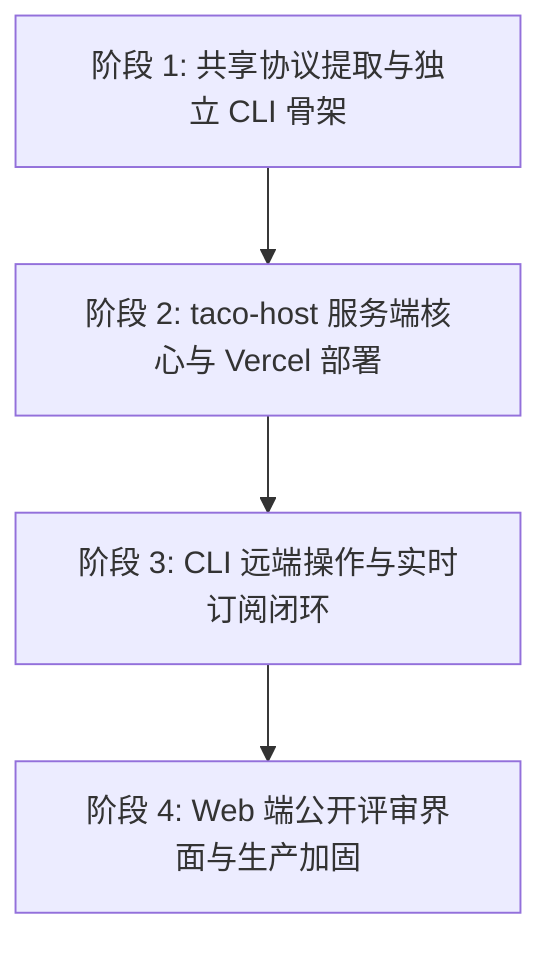

## 1. 架构目标与职责划分

根据已获批的 [产品契约](spec.md)、[数据模型](data-model.md)、[OpenAPI 规范](contracts/openapi.yaml)、[协议 Schema](contracts/protocol.schema.json) 和 [CLI 规范](contracts/cli.md)，本项目由三个明确解耦的职责模块组成：

| 模块                            | 规划目录         | 职责与技术边界                                                                                                                                                                       |
| ------------------------------- | ---------------- | ------------------------------------------------------------------------------------------------------------------------------------------------------------------------------------ |
| **taco** (核心协议与离线渲染)   | `src/`           | `taco/files` v1 协议定义、快照校验、离线 Markdown 编辑、代码块/图表渲染与锚点计算                                                                                                    |
| **taco-cli** (独立二进制客户端) | `packages/cli/`  | 独立打包分发为单二进制文件（`taco-cli`）。内嵌离线帮助与指南（`skills/`），执行 publish、update、subscribe、events、close、export，处理凭据持久化与两阶段上传                        |
| **taco-host** (评审服务端)      | `packages/host/` | 部署于 Vercel。提供 OpenAPI v1 HTTP 接口与原生 WebSocket 订阅服务；以 Marketplace Neon Postgres 存储五类实体与事件日志；以私有 Vercel Blob 存储不可变快照正文；提供公开 Web 评审单页 |

---

## 2. 核心架构决策 (Architecture Decisions)

### AD-0: 三模块目录隔离 (Directory Segregation)

三个产品模块在仓库中物理隔离，禁止相互依赖对方的业务实现代码。采用 npm workspaces，每个模块拥有独立 `package.json` 与 `tsconfig.json`，依赖方向唯一：

```text
taco/
├── src/                  # taco 核心库：taco/files 协议 + 浏览器离线编辑（Vite 应用根，保持现有位置）
├── packages/
│   ├── protocol/         # @taco/protocol 共享纯函数库：JCS、SHA-256、SafePath、白名单投影、锚点校验
│   ├── cli/              # @taco/cli：独立二进制 taco-cli（仅依赖 @taco/protocol）
│   └── host/             # @taco/host：Vercel Functions 服务端（仅依赖 @taco/protocol）
└── extensions/taco/      # 现有 Spec Kit 扩展（历史遗留，后续切换至 taco-cli 能力）
```

- **唯一合法依赖路径**：`@taco/cli → @taco/protocol`、`@taco/host → @taco/protocol`。
- **禁止**：`packages/cli` 或 `packages/host` 导入 `src/` 浏览器运行时代码（`tiptap-editor.ts`、`store.ts` 等 UI/编辑器实现）。
- **禁止**：`packages/host` 与 `packages/cli` 互相导入；二者仅通过 OpenAPI/WS 契约交互。
- **禁止**：`packages/protocol` 依赖 DOM API、Node.js 专有 API 或任何网络库；保持纯函数，可同时运行于浏览器、Node 与 Bun。
- 现有 `src/model.ts`、`src/comments.ts`、`src/security.ts` 中的纯验证逻辑在 T001 迁移至 `packages/protocol/` 后由 `src/` 通过 workspace 引用回归，不复制两份实现。

### AD-1: 独立 binary 客户端 (`taco-cli`) 构建方案

- **目标**：用户机器无需预装 Node.js 或 Spec Kit，单二进制即开即用。
- **选型与方案**：
  - 源码位于 `packages/cli/`，基于 TypeScript 开发，使用 Bun 单文件编译或 Node SEA 打包为跨平台独立可执行文件（macOS arm64/x64、Linux x64/arm64）。
  - 构建时将 `packages/cli/skills/` 下的指南文档编译内嵌为不可变静态资源。
  - 单次命令输出默认为紧凑 JSON，失败输出为结构化 `ErrorResponse` 到 stderr；订阅流为逐行 NDJSON。

### AD-2: 发布/更新双阶段暂存提交流程 (Two-Phase Upload & Commit)

- **约束**：Vercel Function 入站请求硬限制为 4.5 MB，但业务需求支持最大 32 MiB 完整快照（包含 base64 PNG）。
- **流程**：
  1. `taco-cli` 准备上传包并计算 JCS `contentHash` 和完整 `payloadHash`。
  2. 调用 `POST /v1/uploads` 申请预约，服务端在 Postgres 记录 pending 预约并返回带短期有效期的私有 PUT 签名 Blob URL。
  3. `taco-cli` 使用标准 HTTP PUT 直接直传数据至 Vercel Blob（绕过 Function 入站限制）。
  4. `taco-cli` 发起轻量级提交 (`POST /v1/tacos` 或 `POST /v1/tacos/{id}/revisions`)，携带 `uploadId` 与相同 `Idempotency-Key`。
  5. 服务端 Function 从内部私有 Blob 读取数据并完整校验哈希与内容，校验通过后进入 Postgres 事务完成元数据确权与事件追加。

### AD-3: 事件流持久化与 WebSocket 订阅轮换

- **数据源**：Postgres 的 `events` 追加日志为唯一权威，单 Taco 内通过行锁自增分配连续递增的 `sequence`。
- **订阅模型**：
  - 客户端通过 `GET /v1/tacos/{id}/subscribe` 建立原生 WebSocket 连接，连接绑定至当前 Function 实例。
  - 函数从 Postgres 读取当前高水位 $H$。初次连接下发 `ready(cursor=H, mode=live)`；断线恢复下发 `ready(cursor=after, mode=replay, replayThrough=H)`，顺序补发历史事件后进入实时增量流。
  - 增量事件由函数实例定时轮询（~1s）Postgres 事件表尾部。无活跃连接时不轮询数据库，不维持跨实例广播总线。
  - 针对 Function 300s 生命周期上限，服务端在 240s 发送 `1012` 关闭帧触发客户端平滑轮换；客户端携带最新 cursor 自动重连。
  - 只有在空间关闭且事件日志追平后，才下发带有 `reason='taco.closed'` 的 `1000` 正常结束帧。

---

## 3. 实施阶段规划 (Phased Rollout)

实施将分为四个有序阶段，保持各模块测试覆盖：



### 阶段 1：共享协议提取与独立 CLI 骨架

- **目标**：建立 `packages/protocol/` 共享库与 `packages/cli/` 独立客户端骨架；从 `src/` 提取纯协议验证与安全模型；实现离线 `help`、`skills` 以及本地 `--dry-run` 投影能力。
- **交付内容**：
  1. 建立 npm workspaces 结构；抽取共享协议与安全校验工具库至 `packages/protocol/`（路径规范化、JCS 规范化、JCS SHA-256 计算、白名单校验），`src/` 改为引用该 workspace 包。
  2. 初始化 `packages/cli/` 工程（独立 `package.json` 与 `tsconfig.json`，仅依赖 `@taco/protocol`），实现 `taco-cli` 命令行解析器（严格禁止 `--json` / `--public`，未知选项退出 2，错误输出结构化 JSON）。
  3. 内嵌指南资产管理：在构建时内嵌 `skills/taco/SKILL.md` 及参考文档，支持 `taco-cli skills list/read`。
  4. 实现 `taco-cli publish --dry-run` 与 `update --dry-run` 本地投影逻辑。

### 阶段 2：taco-host 服务端核心与持久化层

- **目标**：在 `packages/host/` 建立基于 Vercel Functions 的服务端架构（独立 workspace，仅依赖 `@taco/protocol`），集成 Neon Postgres 与私有 Vercel Blob。
- **交付内容**：
  1. Postgres DDL 与数据访问层：定义 `users`, `api_keys`, `tacos`, `revisions`, `events`, `upload_reservations`, `mutation_receipts`, `threads`, `reviewer_states`。
  2. 匿名凭据引导端点：`POST /v1/anonymous-credentials`，实现受限流的匿名用户与 ApiKey 原子分配。
  3. 双阶段上传与提交端点：`POST /v1/uploads` 签名生成；`POST /v1/tacos` 与 `POST /v1/tacos/{id}/revisions` 轻量提交与校验。
  4. 评审写入端点：`POST /v1/tacos/{id}/reviews`，实现可辨别联合操作、空操作幂等与单调 sequence 分配。
  5. 公开读取与流式导出：`GET /v1/tacos/{id}`、`GET /v1/tacos/{id}/revisions/{rev}` 与 `GET /v1/tacos/{id}/export`。

### 阶段 3：CLI 远端交互与实时订阅端点

- **目标**：`taco-cli` 连通 Host API，完成端到端发布、更新、事件拉取与长连接订阅。
- **交付内容**：
  1. CLI 本地凭据管理：安全保存/读取 ApiKey（系统凭据库优先，回退至 0600 文件），处理环境覆盖与 host 绑定。
  2. CLI 双阶段发布实现：申请预签名、PUT 直传、轻量提交；网络中断同键重试。
  3. WebSocket 订阅服务端：`GET /v1/tacos/{id}/subscribe`，高水位捕获、补读重放、1s 尾读轮询、240s 优雅轮换 (1012)。
  4. CLI `subscribe` 与 `events` 命令：流式输出 NDJSON，处理背压与断线指数退避重连。

### 阶段 4：Web 评审界面与集成交付

- **目标**：提供只读公开评审 Web 页面，加固全链路安全与验收场景覆盖。
- **交付内容**：
  1. Web 端静态评审应用：加载快照、展示 Markdown/图片/代码块、高亮锚点、展现讨论线程。
  2. Web 端访客互动：调用 `POST /v1/guest-session` 获取 Cookie，提交评论与审核确认。
  3. 按照 `spec.md` 第 10 节编写端到端自动化验收套件（21 条场景验证）。
  4. 多平台独立 binary 构建流程与 GitHub Release 打包脚本。
