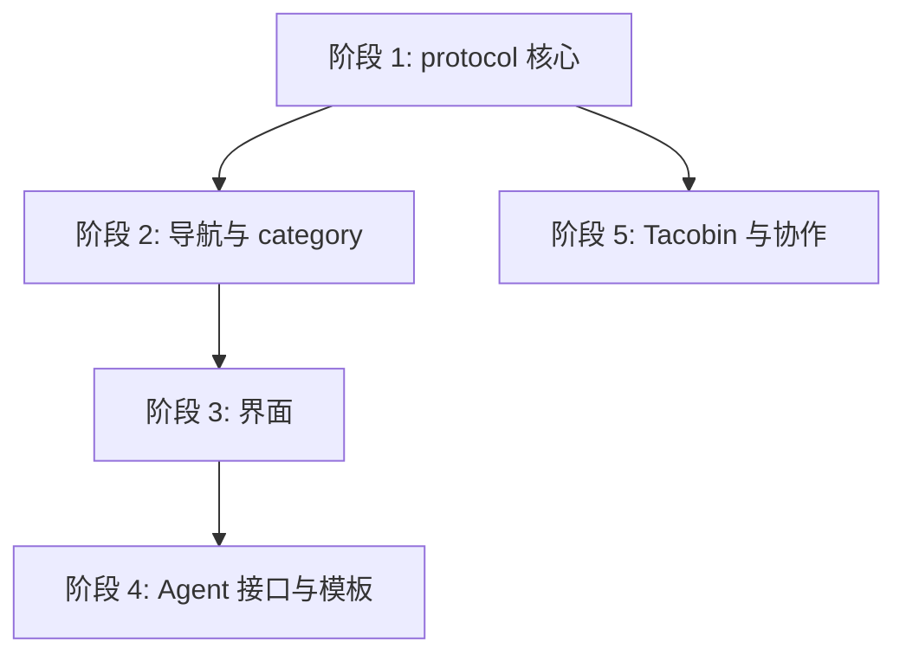

## 1. 模块划分

本计划依据 [spec](spec.md)。依赖方向沿用 008 AD-0：`src/` 与 `packages/host` 都依赖 `@taco/protocol`，Host 不导入 `src/`。

| 模块       | 位置                                                                                                                                     | 本特性职责                                                                                               |
| ---------- | ---------------------------------------------------------------------------------------------------------------------------------------- | -------------------------------------------------------------------------------------------------------- |
| protocol   | `packages/protocol/src/checkpoints.ts`（新）                                                                                             | 类型、校验、成员表、排列、派生状态。全部是同步纯函数，没有外部依赖                                       |
| taco 核心  | `src/model.ts`、`src/category.ts`、`src/navigation.ts`                                                                                   | bundle 字段、category 来源 `checkpoint`、Checkpoint 分组与占位行                                         |
| taco 界面  | `src/ui-primitives.ts`、`src/file-navigation.ts`、`src/file-browser.ts`、`src/checkpoint-view.ts`（新）、`src/i18n.ts`、`src/styles.css` | 状态图形、置顶菜单项、分组锁定、页头 Checkpoint 标签、占位页、Checkpoint 视图；视觉规格见 [ui.md](ui.md) |
| taco 协作  | `src/sync/validation.ts`                                                                                                                 | 实时协作时保留并校验 `checkpoints`                                                                       |
| Agent 接口 | `src/main.ts`、`skills/taco/`                                                                                                            | `window.taco.getCheckpoints()`、Handoff、生成脚本、SKILL.md                                              |
| 模板       | `extensions/taco/templates/`                                                                                                             | `checkpoints` 定义                                                                                       |
| Tacobin    | `packages/protocol/src/{types,validation,projection}.ts`、008 `contracts/protocol.schema.json`                                           | 快照携带 `checkpoints`；展示由 shell 的 reader 模式自动提供                                              |

## 2. 架构决策

### AD-1：纯核心放在 `@taco/protocol`

`packages/protocol/src/checkpoints.ts` 导出以下函数，并从 `index.ts` 统一导出：

```ts
export type DocumentStatus = 'todo' | 'in_progress' | 'complete' | 'freeze'
export interface CheckpointDocumentRef {
  path: string
  optional?: boolean
}
export interface CheckpointNode {
  id: string
  title: string
  after: string[]
  documents: CheckpointDocumentRef[]
}
export interface DocumentStatusRecord {
  path: string
  status: DocumentStatus
  updatedAt: string
}
export interface CheckpointsState {
  version: 1
  template?: string
  nodes: CheckpointNode[]
  documents: DocumentStatusRecord[]
}

export function validateCheckpoints(
  value: unknown,
  root: string,
): { ok: true; value: CheckpointsState } | { ok: false; err: string; path: string }
export function checkpointMembership(
  state: CheckpointsState,
): ReadonlyMap<string, { nodeId: string; optional: boolean }>
export function checkpointLayout(state: CheckpointsState): string[][] // spec §4：拓扑层级，同层按 id 排序
export function resolveCheckpoints(bundle: {
  root: string
  files: { path: string }[]
  checkpoints?: unknown
}): ResolvedCheckpoints
export function setDocumentStatus(
  state: CheckpointsState,
  path: string,
  status: DocumentStatus,
  now: string,
): CheckpointsState
```

- `validateCheckpoints` 覆盖 spec §3 的全部规则。环检测在 `checkpointLayout` 中用 Kahn 算法完成，校验直接复用它的结果，不写第二份实现。错误返回 JSON 路径（例如 `checkpoints.nodes[2].after[0]`），供界面警告和 Host 报错使用。
- 排序使用 JS 默认的 `sort()`，即按 UTF-16 码元排序（spec §4）。
- 全部是同步函数：导航渲染、`getCheckpoints()` 和脚本都可以直接调用，不需要异步路径，也不需要结果缓存。`resolveCheckpoints` 只读取文件路径，不读取文件内容。
- `ResolvedCheckpoints` 包含 `raw`、`valid`、`error?`、`state?`、`nodes`、`documents`、`layout`、`frontier`、`unlinked`；浏览器与脚本共用同一个类型。`frontier` 和 `unlinked` 不生成 Checkpoints 页面文案。

### AD-2：bundle 字段与非法值的处理

- `src/model.ts`：`TacoBundle` 增加 `checkpoints?: unknown`，保留原始值；渲染侧按需调用 protocol 的解析函数，不维护第二份派生状态。
- `parseBundle` **不**因 `checkpoints` 非法而拒绝整个 bundle，也不删除这个字段。这与 navigation 非法时直接丢弃的做法不同（spec §3）。
- 非法时：界面顶部显示一条警告（包含错误路径），关闭 Checkpoint 分组、占位行和状态控件；保存时 `checkpoints` 原样写回。
- CLI `extensions/taco/bin/taco.mjs` 的 pack 已经通过 `...(priorBundle ?? {})` 保留未知顶层字段，不需要改。`validateBundle` 也不对 `checkpoints` 报错，校验留给浏览器和 Host，避免旧 CLI 刷新时因为新字段失败。

### AD-3：category 来源 `checkpoint`

- `FileCategoryResolution.source` 增加 `'checkpoint'`，同时新增字段 `checkpointId?: string` 和 `overridden?: string`（被覆盖掉的原始 category 值）。
- `resolveFileCategory` 第一步先查成员表：命中时返回 `{ category: node.title, source: 'checkpoint', canEdit: false, checkpointId, overridden }`，否则走原有流程。
- 占位文件没有 `TacoFile`，因此提供 `resolvePathCategory(bundle, path)` 供占位行使用。`resolveFileCategory` 改为调用它，共用一套逻辑。
- `updateFileCategory` 遇到 `source === 'checkpoint'` 时直接抛错，作为兜底；正常情况下界面不会暴露这个入口。

### AD-4：两段式导航解析

`resolveDocumentNavigation` 改为：

```ts
export interface PlaceholderEntry {
  kind: 'placeholder'
  path: string
  checkpointId: string
  optional: boolean
}
export type NavigationEntry = { kind: 'file' | 'category-file'; file: TacoFile } | PlaceholderEntry

export interface ResolvedCheckpointGroup {
  id: `checkpoint-${string}`
  title: string
  checkpointId: string
  entries: NavigationEntry[]
  isCustom: false
  isCheckpoint: true
  locked: true
}
export interface ResolvedDocumentNavigation {
  mode: 'custom' | 'stage'
  checkpointGroups: ResolvedCheckpointGroup[] // 新增，恒在最前
  groups: ResolvedGroup[] // 普通分类及其他非 Checkpoint 分组
  unassigned: TacoFile[]
  warnings: {
    path: string
    reason: 'manifest-path-owned-by-checkpoint' | 'category-overridden' | 'category-title-collision'
  }[]
}
```

1. `checkpoints` 合法时：按 `checkpointLayout` 的顺序生成 `checkpointGroups`；组内先列必需文档、后列可选文档，各自按 `path` 排序；文件存在时用 `file` 条目，不存在时用 `placeholder` 条目。
2. 用成员表建一个"已占用"集合，其余文件走原有三层逻辑，并做三处调整：
   - manifest 分支跳过已占用的路径，记录 `manifest-path-owned-by-checkpoint` 警告；
   - category 分支中，`hasCategoryDeclaration` 只统计未占用的文件；
   - stage 分支的输入是过滤掉已占用路径的文件列表。
3. `mode` 的含义保持不变，只描述第 2 步用的是哪种模式。

`checkpointGroups` 单独成为一个字段，而不是塞进 `groups`，理由有两个：`file-navigation.ts` 和 `navigation-editor.ts` 中所有编辑操作都以 `groups` 为对象，放在单独字段里，锁定就由类型保证，不需要在每个操作里判断；另外，`groups` 的现有测试和调用方都不需要改。

### AD-5：界面锁定

- `file-navigation.ts` 渲染 `checkpointGroups` 时保留新增文件按钮和聚合状态图标，但不提供分组重命名、删除或拖放；新增文件默认归入该 Checkpoint category（导航 manifest），不修改节点文档成员表。仅已创建的 Checkpoint 文档行最右侧显示可点击的状态图标；悬停时 `…` 菜单位于状态图标左侧且不遮挡它。Checkpoint 分组新增按钮与文件行操作按钮对齐。
- 文件行菜单：Checkpoint 文档去掉"移动到分组"和"删除"，保留"设为入口"和"重命名"。
  - 保留重命名是按 spec §6：重命名后，原路径变回占位行。
  - 不提供删除：删掉的内容无法从占位行恢复。确需删除时，在文件页操作。
- `navigation-editor.ts` 的 `moveFileToGroup` 遇到已占用路径时直接返回原 manifest，作为兜底。
- 所有状态控件和"创建文件"按钮在 `bundleCanWrite(bundle) === false` 时禁用，Host 的 reader 模式和协作中的 reader 角色都走这条路径。

### AD-6：状态写入与脏标记

- 状态写入只修改 `bundle.checkpoints.documents`，经 `store.commit({ kind: 'document' }, …)` 提交。`BundleDirtyTracker` 的 `documentSignature` 已经包含所有非 files/comments/collab 的字段，因此改状态会被正确地标记为脏。
- `setDocumentStatus` 是纯函数，返回一个新对象，由界面整体替换 `bundle.checkpoints`；状态没有变化时返回原对象，不改动 `updatedAt`。

### AD-7：Checkpoint 视图与占位页

- `src/file-navigation.ts` 将入口呈现为**文档树之外**的置顶内置菜单项，`src/checkpoint-view.ts` 渲染其主区域：
  - 独立的 `.sidebar-pinned` 位于品牌行下方、`sidebar-scroll` 上方，不画分隔线，下方留出比分类间距更大的空白；
  - 不属于 `ResolvedDocumentNavigation`，没有文件行菜单；选中时主区域显示 Checkpoints 视图，文件选中态取消。
- Checkpoints 页面标题为 `Checkpoints: <模板名称>`；名称编辑写入 `template`，只读模式禁用。不渲染 `frontier` 摘要或 `unlinked` 列表，后两项仍在 `resolveCheckpoints` 结果中供 Agent 使用。
- 按 `checkpointLayout` 纵向排列层级，同层横排且桌面不换行。卡片沿用 Taco 的 surface、边框、字色和 accent token：所有卡片有柔和阴影，文档行最小 46px、上下各 10px，标题与文档状态图标同列居中；可用且未冻结时仅以边框强调，不画左侧色条；等待前置时用虚线边框。阅读区域允许双轴滚动，SVG 连线随图一起滚动；≤620px 同层纵向堆叠并隐藏连线。
- 占位页复用文件页的外壳，正文区显示路径、所属 Checkpoint、optional 标记和"创建文件"按钮，不显示状态控件或空内容提示。
- 占位页为已声明的路径创建文件；普通新增对话框提供本地化的文件类型、文件名和含 Checkpoint category 的分类选择；从 Checkpoint 分组打开时默认选择该 category。两种创建操作都不改变 Checkpoint 节点成员表；只有在定义中已引用的路径才会成为 Checkpoint 文档。
- 文件页头：`syncWorkspaceHeader` 发现当前文件是 Checkpoint 文档时，把 `categoryBadge` 渲染为只含 Checkpoint 标题的不可点击标签，边框略作区分；不显示状态。category 被覆盖时，悬停提示说明原 category 未生效。普通文件显式选择 Checkpoint category 后标签仍可编辑，也没有状态；状态菜单只从已创建的 Checkpoint 文档侧栏行和 Checkpoint 视图文档行打开（ui.md §4）。确认、输入、署名和预览等对话框统一使用共享 `control-button` 操作按钮。

### AD-8：Agent 接口

- `window.taco.getCheckpoints()` 同步返回 `resolveCheckpoints(bundle)`，基于内存中的当前 bundle，包含尚未保存的修改。
- `getReviewHandoff()` 增加 `checkpointChanges`、`checkpointTemplateChange` 和 `checkpointDocumentAdditions`：`capturePristine()` 记录原始状态、名称和节点成员表，分别输出状态路径变化、名称变化与新增文档成员。复制到剪贴板的 Handoff Markdown 同步列出这些变化。
- 生成脚本 `skills/taco/scripts/checkpoints.mjs`：新增 `scripts/build-checkpoints-script.mjs`，用 esbuild（随 vite 一起安装）把 `packages/protocol/src/checkpoints-cli.ts` 打包成单个 ESM 文件。脚本读取 `.taco.html`，用与 `build-template-htmls.mjs` 相同的 `DATA_BLOCK` 正则取出数据块，调用 `resolveCheckpoints`，从 stdout 输出 JSON。Node 版本要求与仓库 `engines` 一致（22 及以上）。这一步加进 `npm run build`，并由测试检查产物与源码一致。
- SKILL.md 按 spec §10 第 4 条补充；刷新时的保留清单加上 `checkpoints`。

### AD-9：Tacobin

- `types.ts`：`DocumentSnapshot` 增加 `checkpoints?: CheckpointsState`。
- `validation.ts`：`validateDocumentSnapshot` 调用 `validateCheckpoints`，失败时返回 `Checkpoints invalid at <path>: <err>`，拒绝发布。
- `projection.ts`：`ALLOWED_TOP_LEVEL_PROPERTIES` 加入 `checkpoints`，snapshot 中原样携带。
- 008 `contracts/protocol.schema.json`：快照 schema 加入 `checkpoints`。
- Host 页面不需要改代码：`app/t/[id]/route.ts` 通过 `...parsed.snapshot` 连同 `access: 'reader'` 注入 shell，只读展示直接由 AD-5 的禁用逻辑保证。

### AD-10：实时协作

- `src/sync/validation.ts`：`DOC_SET_KEYS` 加入 `checkpoints`；`rebuildSyncDoc` 用 `validateCheckpoints` 校验，通过后保留。
- 远端传来非法值时，与 navigation 的处理保持一致，丢弃这次远端值，本地值保持不变，不能因此清空本地状态。
- 并发写入按整个对象最后写入者生效（spec §10）。

### AD-11：模板

- `extensions/taco/templates/spec/bundle.json`：删除 `navigation`，加入 `checkpoints`（spec → plan → tasks）。
- 新增 `extensions/taco/templates/quick/` 快速需求模板包，包含 README、template.md、bundle.json、empty.taco.html，结构与现有模板包一致。

## 3. 实施阶段



阶段 5 只依赖阶段 1，可以和阶段 2、3 并行。

### 阶段 1：protocol 核心

- 实现 `checkpoints.ts`（AD-1），并在 `index.ts` 中导出。
- 在 `packages/protocol` 下新增单元测试 `checkpoints.test.ts`，覆盖：
  - spec §11 场景 2、4、5、6；
  - 每条校验规则各一个反例；
  - `setDocumentStatus` 在状态不变时返回原对象。

### 阶段 2：导航与 category

- AD-2 的字段与缓存；AD-3、AD-4。
- 测试：
  - 扩展 `tests/category.test.ts`：覆盖来源 `checkpoint`、`overridden`，以及 frontmatter 中 category 与 Checkpoint 标题同名的情况。
  - 扩展 `tests/navigation.test.ts`：三种导航模式下 `checkpointGroups` 都在最前；占位条目；manifest 跳过已占用路径并给出警告；`hasCategoryDeclaration` 忽略已占用文件；没有 `checkpoints` 时输出与现在完全相同。
  - `tests/stage-navigation.test.ts` 不需要改动。

### 阶段 3：界面

- AD-5、AD-6、AD-7。
- 测试：
  - 扩展 `tests/file-browser.test.ts`：Checkpoint 分组没有编辑入口；状态切换后 ⌘S 保存，数据块中只有 `documents` 变化；reader 模式下所有控件禁用；占位行和占位页无状态，创建文件后既有状态记录保持不变；从 Checkpoint 分组新增普通文件默认归入其 category、不改变节点成员表、没有状态，并仍可从页头切换分类。
  - 在浏览器中实际打开用 §3 示例生成的 `.taco.html`，目视确认 Checkpoints 入口、只有标题与 DAG 的视图（无模板来源、frontier 摘要或未关联列表）、占位行；检查细边框技术卡片、可用性提示、正交连线及窄屏堆叠无连线，并确认侧栏图标和页头状态入口符合 [ui.md](ui.md)。

### 阶段 4：Agent 接口与模板

- AD-8、AD-11。
- 测试：
  - `tests/templates.test.ts`：skill 镜像与源码一致；模板中的 `checkpoints` 能通过 `validateCheckpoints`。
  - 新增脚本测试：对同一个 fixture，`checkpoints.mjs` 的输出与 `resolveCheckpoints` 的结果完全相同。
  - 扩展 `tests/agent-instructions.test.ts`：SKILL.md 的保留清单中包含 `checkpoints`。

### 阶段 5：Tacobin 与协作

- AD-9、AD-10。
- 测试：
  - 扩展 protocol 的 projection/validation 测试：合法的 `checkpoints` 原样通过，非法时报错并给出路径。
  - 扩展 `tests/collaboration.test.ts`：应用远端文档后 `checkpoints` 仍然保留；远端传来非法值时，本地值不变。
  - 在本地 Host 上执行 `publish --dry-run` 并正式发布，然后打开页面，确认只读展示正常、派生结果与本地一致（spec §11 场景 12）。

## 4. 风险

| 风险                                   | 处理                                                                                               |
| -------------------------------------- | -------------------------------------------------------------------------------------------------- |
| 旧版 shell 打开带 `checkpoints` 的文件 | 旧版 shell 通过 `[extra]` 保留这个字段，只是不显示，也不会丢失。刷新 Taco 时 shell 会升级到新版    |
| 旧版 relay 协作端丢掉 `checkpoints`    | 这个问题无法向后兼容。协作双方需要使用同一版本的 shell；在 changelog 中注明                        |
| 定义很大时，按需解析 DAG 与成员表      | 纯函数保持同步、只读取路径；先依据实际性能数据判断是否需要缓存，不引入与 bundle 状态不同步的缓存层 |
