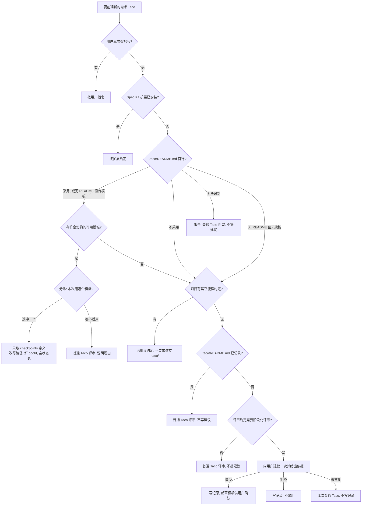

## 1. 背景与问题

Taco 已有 Checkpoints（阶段 DAG、文档状态表、每份文档的 `instruction`），但 Agent 写 Taco 时不会主动参考项目里的 Checkpoint 规范；项目没有规范时，也没人提出要不要建立。每次需求要产出哪些文档、每份文档的硬性要求，全凭会话临场判断。

原提案（新建 `taco-checkpoints` skill、`.taco/checkpoints.json` 第二份 schema、AGENTS.md 受管段落与字节幂等接线）已在 2026-10-02 用户评审中否决。本设计只在现有 `skills/taco/` 上做简短扩展。

### 1.1 本版修订来源

2026-10-02 第二轮人工评审认可方向（不新建 skill、不引入第二份 schema、复用现有打包排除规则），并要求先解决与现有 `skills/taco/SKILL.md` 文字的冲突。本版逐条落实：

| 评审意见 | 落实位置 |
| --- | --- |
| 1. 建议的触发信号不能用文档数量 | §3.4 |
| 2. 模板选择是分诊，不是「采用即套用」 | §3.2 |
| 3. 选用模板的节点视为已安排，与占位防御规则对齐 | §3.3、§5 |
| 4. 决定记录首行固定、可机读；多模板列适用场景 | §4.2 |
| 5. 规范优先级 | §3.1 |
| 6. 路径映射与新 `docId` | §3.3 |
| 7. `instruction` 页面只读，只在用户要求时修改模板 | §3.5 |
| 8. 确认空模板可加载 | §4.1（已实测） |
| 9. 模板载体取舍理由 | §4.1 |
| 验收标准 5 改为固定场景 | §8、§9 |

### 1.2 现状证据

| 位置 | 现状 | 与本需求的关系 |
| --- | --- | --- |
| `skills/taco/SKILL.md:24` | 已要求优先使用「project-owned templates or review policy」，但没说到哪里找 | 补发现顺序与优先级 |
| `skills/taco/SKILL.md:26` | 「按评审约定决定是否用 Checkpoints，不看任务标签或文档数量」 | 建议的触发信号必须与此一致（§3.4） |
| `skills/taco/SKILL.md:28, 186, 213` | 不得硬搬模板结构；只为已存在或「用户明确安排」的文档声明 Checkpoint；`not created` 占位只在有意安排时才正常 | 需写明「本次选用的项目模板节点视为已安排」（§3.3） |
| `src/model.ts:145-146` | `parseBundle` 要求 `root` 安全，`files` 只需是数组 | 空模板 `files: []` 合法 |
| `packages/protocol/src/checkpoints.ts:144-146, 184-185` | `checkpoints.documents` 必须是数组；文档路径必须安全且在 `root/` 内 | 模板与派生 Taco 都带 `documents: []`，路径按新 `root` 改写 |
| `src/file-browser.ts:1101-1102`、`src/checkpoint-view.ts:186-217` | `Instruction` 内容只读；卡片只能改状态 | 与评审意见 7「页面只读」一致，无需改运行时 |
| `skills/taco/SKILL.md:175`、`skills/taco/scripts/pack.mjs:152-153` | 打包内置排除隐藏路径与所有 `*.taco.html` | `.taco/` 不会被打进需求 Taco |
| `skills/taco/scripts/checkpoints.mjs` | 对任意 `.taco.html` 输出 `nodes`、`documents`（含 `instruction`）、`frontier` | 新会话可据此回答「产出哪些文档 / 硬性要求 / 下一步」 |
| `specs/014-agent-taco-output-path/spec.md:31` | 已否决 `.taco/config.yaml` 一类输出配置 | `.taco/` 只放说明文件与模板 Taco，不是配置 |

## 2. 目标与非目标

### 2.1 目标

1. 写新需求 Taco 前，Agent 按固定优先级发现并遵循项目的 Checkpoint 规范。
2. 项目 `.taco/` 下可以有零个、一个或多个模板；每次需求由 Agent 分诊：不用模板，或选其中一个，并说明依据，用户可推翻。
3. 选用模板时只取 `checkpoints` 定义，按本次 `root` 改写路径，生成新 `docId`、空状态表；写文档前满足对应 `instruction`。
4. 项目无规范、无记录，且本次评审约定需要阶段化评审时，向用户提一次项目级建议；用户答复后在 `.taco/README.md` 记录，此后不再询问。
5. 增量简短：`SKILL.md` 增量 ≤ 2 KB，细则放 `references/checkpoints.md`。

### 2.2 非目标

- 不新建 skill 目录；不引入 `.taco/checkpoints.json` 或任何第二份 schema；不引入 `{feature}` 占位符语法。
- 不改 Taco 运行时的渲染与数据模型；`instruction` 在页面上保持只读。
- 不做 AGENTS.md 受管段落与字节幂等接线。
- 不改 `extensions/taco/`（含 `taco-speckit` skill）与 `packages/cli/src/skills.ts` 内嵌指南；不强制安装 Spec Kit 扩展。
- 不新增脚本或 CLI 能力；不做云端/协作相关能力。

## 3. 方案



### 3.1 规范优先级

写**新**需求 Taco 前，取第一条命中的来源：

1. **用户本次指令**：明确要求或禁止 Checkpoint、指定模板或图结构。
2. **Spec Kit 扩展约定**：项目已安装 `.specify/extensions/taco/` 时，沿用扩展自身约定（与 `SKILL.md:20` 一致）。
3. **`.taco/` 决定记录与模板**：先读 `.taco/README.md` 首行（§4.2），再看模板：
   - 首行「采用」，或没有 README 但 `.taco/` 下有模板：有符合契约（§4.1）的可用模板时进入 §3.2 分诊；没有可用模板时报告并进入第 4 步。
   - 首行「不采用」：不使用 `.taco/` 下的任何模板；进入第 4 步。
   - 首行无法识别：报告，本次按普通 Taco 评审，不提建议，不改写 README；不进入后续步骤。
   - 没有 README 也没有模板：进入第 4 步。
4. **项目其它流程约定**：`AGENTS.md`/`CLAUDE.md`、`CONTRIBUTING*`、`.github/pull_request_template.md`、`specs/` 或 `docs/adr/` 的目录惯例。命中时据此决定本次文档集合与评审顺序，报告中写明依据（文件与行）；不要求迁移到 `.taco/`。
5. **skill 自带示例**（`templates/spec/` 等）：只作参考，不是默认结构（沿用 `SKILL.md:24-28`）。

都未命中时，按 §3.4 判断是否提建议。已有 `.taco/README.md` 记录（无论采用或不采用）时，不再询问**是否采用项目级模板**；本次选哪个模板（§3.2-4）以及澄清用户指令所需的提问不受此限制。

项目根 = 向上找到 `.git` 目录或 `gitdir:` 文件所在目录（与 `references/output-path.md` 一致）；仓库内有多个 `.taco/` 时，取离工作目录最近的一份，并在报告中写明。

刷新既有 Taco 不重新分诊、不重新套模板：沿用 `SKILL.md` 刷新规则，完整保留既有 `checkpoints` 定义与状态表。

### 3.2 模板分诊

「项目已采用模板」只表示**有可选项**，不表示每次都必须用。每次新需求：

1. 确定候选模板与依据：有 README 时，读其中列出的模板及适用场景；没有 README 时，枚举 `.taco/` 下全部符合契约的模板，从模板标题、节点、`instruction` 推断适用场景，并在报告中提示补充记录（不自动创建或修改 README）。再对照本次需求的评审约定（是否需要阶段化评审、跨角色确认、命名的评审里程碑）。
2. 分诊结果二选一：
   - **选用其中一个模板** → §3.3；
   - **不用模板** → 普通 Taco 评审（不带 `checkpoints`）。简单修改通常落在这里（Linear 2026-09-29 评论：「支持不使用模板或按小任务少做」）。
3. 在本次回复中说明结果和依据，例如「选用 Feature_Checkpoints：需求涉及方案与计划两轮评审」或「不用模板：单文件文案修订」。用户可以推翻。
4. 依据不足以在多个模板间选择时，询问用户选哪个。这是选模板，不是重新询问是否采用。

分诊不写入任何文件；`.taco/README.md` 只记录项目级决定。

### 3.3 选用模板：只取定义，不复制运行时

1. **校验**：读取模板数据块，按 `validateCheckpoints` 的完整规则校验 `checkpoints`（`version` 为 1、节点 `id` 唯一、`after` 只引用已有 id 且无环、文档路径安全、无重复且以模板 `root/` 开头、`documents` 是数组）。`parseBundle` 不校验 `checkpoints`，不能只看它通过。不满足即视为模板损坏：报告，本次不用该模板，不猜测修复。
2. **只取定义**：只取 `checkpoints.nodes`。新 Taco 生成新的 `docId`（`crypto.randomUUID()`），不继承模板的 `docId`、`title`、`files`、`comments`、`navigation` 与状态表。
3. **路径映射**：模板 `root` 固定为约定值 `feature`（§4.1）。对每个文档路径，去掉 `feature/` 前缀，再拼上本次 `root/`。例：`feature/plan.md` + 本次 `root: "specs/018-search"` → `specs/018-search/plan.md`。映射后对新 `root` 重跑第 1 步的路径校验。`root` 不是 `feature` 的模板不符合项目模板契约：报告，本次不用；正常需求中不修改模板（§3.5）。
4. **保留与置空**：`id`、`title`、`after`、`optional`、`instruction` 原样保留；`checkpoints.template` 写模板标题；`checkpoints.documents` 置为 `[]`。
5. **重新打包**：用当前 skill 的外壳（按 `SKILL.md`「Locate the shell」选变体）打包。
6. **占位视为已安排**：本次选用的项目模板里声明的节点和文档，视为 `SKILL.md:186, 213` 所说的「已安排的工作」，尚未创建的文档以 `not created` 占位显示是预期结果，不按「硬搬模板」删除。这条例外只适用于本次分诊选中的 `.taco/` 模板，不适用于 skill 自带示例（`SKILL.md:28` 不变）。
7. **写文档**：写任一 Checkpoint 文档前，先读其 `instruction` 并满足；用 `frontier` 建议下一步（建议，不是门禁）。

新会话回答「产出哪些文档 / 硬性要求 / 下一步」：对已生成的需求 Taco（或模板）运行 `node <skill>/scripts/checkpoints.mjs <file.taco.html>`，分别读 `nodes[].documents[].path`、`documents[].instruction`、`frontier`。

### 3.4 无规范时：按评审约定建议一次

**提建议的条件**（同时满足）：

- 当前目录在某个仓库内（不在仓库内则不提，记录需要落点）；
- §3.1 第 1～4 步都未命中，且没有 `.taco/README.md` 记录；
- 本次需求的**评审约定**需要阶段化评审：存在命名的评审里程碑（如先评方案再评计划）、多阶段评审、或跨角色确认（如产品与开发分别确认）。

**不以文档数量为信号**，与 `SKILL.md:26`「不看任务标签或文档数量」一致；`SKILL.md` 原句不改。简单修改（文案、单点缺陷修复）没有阶段化评审约定，自然不触发建议，也不生成整套 spec/plan/tasks。

**建议内容**：一次提问，写明依据（命中哪项评审约定信号、查过哪些位置未发现规范）、采用后写入什么（`.taco/README.md` 与一个模板 Taco）、拒绝后写入什么（仅 `.taco/README.md`），并说明以后不再询问、改主意可编辑或删除该文件。同一会话最多提一次。

| 用户答复 | Agent 行为 |
| --- | --- |
| 接受 | 立即写 `.taco/README.md`（首行「采用」）；依据仓库证据起草模板，按 §4.1 写入 `.taco/` 交用户确认 |
| 拒绝 | 立即写 `.taco/README.md`（首行「不采用」）；本次普通 Taco 评审 |
| 未答复 / 含糊 | 不写记录；本次普通 Taco 评审；之后会话遇到同类需求可再提 |

Agent 只写文件，不替用户提交。没有用户同意不改 `AGENTS.md` 等项目级流程文件（见待决策点 D1）。

### 3.5 `instruction` 与模板的修改边界

- 页面上 `instruction` 只读，不提供编辑入口（现状如此，本特性不改运行时）。人在 Checkpoints 页和右侧 `Instruction` 标签页**查看**。
- 正常开发过程中，Agent 不修改 `.taco/` 下的模板与 `instruction`，也不修改 `.taco/README.md`。
- 只有用户明确要求调整开发流程（refine）时，Agent 才修改 `.taco/` 下的模板，并在回复中列出改了哪些节点、文档或 `instruction`。
- 已生成的需求 Taco 的 `checkpoints` 定义同样按刷新规则保留，不因模板更新而回写。

## 4. 文件约定（契约）

两个文件都是**说明与用法**，不是新 schema；运行时不读取它们。

### 4.1 模板 Taco

- 位置：`.taco/<文件名>.taco.html`，文件名 stem 为模板标题的规范化结果（与 `references/output-path.md` 一致），例如 `Feature Checkpoints` → `.taco/Feature_Checkpoints.taco.html`。写入属于用户确认后的显式指定（输出级联 L0）；`.taco/` 不是 `SKILL.md` 禁写清单里的 template 目录（那指 skill/扩展自带的模板包）。
- 外壳：默认 Lite；用户要求离线可用时用 Complete。
- 数据块形态（节点名与 `instruction` 只是示意，真实模板由 Agent 依据仓库证据起草、用户确认）：

```json
{
  "format": "taco/files",
  "version": 1,
  "docId": "<新生成的 UUID>",
  "title": "Feature Checkpoints",
  "root": "feature",
  "files": [],
  "checkpoints": {
    "version": 1,
    "template": "Feature Checkpoints",
    "nodes": [
      {
        "id": "spec",
        "title": "需求说明",
        "after": [],
        "documents": [
          { "path": "feature/spec.md", "instruction": "必须包含目标、非目标与可验证的验收条件" }
        ]
      },
      {
        "id": "plan",
        "title": "实现方案",
        "after": ["spec"],
        "documents": [
          { "path": "feature/plan.md", "instruction": "列出受影响组件、契约变更与验证方案" },
          { "path": "feature/data-model.md", "optional": true }
        ]
      }
    ],
    "documents": []
  }
}
```

约束：`root` 固定为 `feature`（`.` 不是安全路径，`src/model.ts:124-128, 145`）；所有文档路径以 `feature/` 开头（`checkpoints.ts:184-185`）；`documents` 必须存在且为 `[]`（`checkpoints.ts:144-146`）；`files` 为 `[]`。

**合法性实测（评审意见 8，2026-10-02）**：把上面的数据块写进 `skills/taco/taco-shell-lite.html`，产物 187,557 字节（`wc -c`；早先记录的 187,455 是 JS 字符串长度，不是 UTF-8 字节数）。

- `node skills/taco/scripts/checkpoints.mjs`：`valid: true`，节点 `spec`、`plan`，三份文档 `exists: false`、`status: todo`，`frontier: ["spec"]`。
- 浏览器打开：标题 `Feature Checkpoints — Taco`，**未进入恢复模式**；侧栏显示「检查点 → 需求说明 / spec.md、实现方案 / plan.md、data-model.md」，正文区显示「此 Taco 不包含文件。」；`window.taco.getCheckpoints()` 返回 `valid: true`、2 个节点。
- `window.taco.validate()`：`ok: true`，0 个错误、3 条 `checkpoint-document-missing` 警告（每份未创建的文档一条）。这些警告对模板是预期结果；对派生的需求 Taco，只要文档属于本次选用的模板（§3.3-6），同样是预期结果，报告时注明即可。

结论：`parseBundle` 接受 `files: []`，指向不存在文件的 Checkpoint 文档不会触发恢复模式，无需额外处理。

**载体取舍（评审意见 9）**：选 `.taco.html` 而不是纯 JSON，换来的是人在浏览器里直接查看 DAG 和每份文档的 `instruction`，并且模板本身就是合法 Taco，`checkpoints.mjs` 与浏览器 `getCheckpoints()` 都能直接读取，不需要第二种解析器或 schema。代价：仓库多一个约 187 KB 的文件，`instruction` 的改动在 diff 里混在 HTML 数据块中。缓解：数据块是 `JSON.stringify(…, null, 2)` 的缩进 JSON，改一条 `instruction` 只产生一行 diff；外壳只在用户要求升级时才替换。

### 4.2 决定记录 `.taco/README.md`

首行固定为下面两种之一（可机读，Agent 只认首行）：

```text
Checkpoint 模板：采用（2026-10-02）
Checkpoint 模板：不采用（2026-10-02）
```

日期为用户答复当天（`YYYY-MM-DD`）。采用时，后续列出每个模板及其适用场景，作为 §3.2 分诊依据：

```markdown
Checkpoint 模板：采用（2026-10-02）

## 模板

- `Feature_Checkpoints.taco.html`：新功能、需要先评方案再评计划的需求。
- `Hotfix_Checkpoints.taco.html`：线上缺陷修复、需要开发与测试分别确认的需求。

不适用以上场景的需求（如文案修改、单点修复）按普通 Taco 评审。

## 决定依据

用户答复原话或理由：「……」

## 如何修改

改变决定：直接编辑或删除本文件。调整模板：请 Agent 修改 `.taco/` 下对应模板，并说明改了什么。
```

读取规则：

- 首行匹配「Checkpoint 模板：采用（…）」或「Checkpoint 模板：不采用（…）」；不匹配视为「记录无法识别」：报告，本次按普通 Taco 评审，不提建议，不改写文件，即使 `.taco/` 下有模板也不使用（与 §3.1 第 3 步一致）。
- 首行「采用」但没有符合契约的可用模板（缺失、无法解析、`root` 不是 `feature`）：报告问题，继续按 §3.1 第 4 步查找项目其它约定，都没有时按普通 Taco 评审；不自动重建模板，不重新提建议。
- 首行「不采用」：即便 `.taco/` 下有模板文件也不使用，提示一次不一致；继续按 §3.1 第 4 步查找其它约定；不再提建议。
- 有模板但没有 README：模板本身就是项目规范，按 §3.2 分诊（候选来源见 §3.2-1），并在报告中提示补充记录。

## 5. 受影响组件

| 文件 | 变更 | 预计增量 |
| --- | --- | --- |
| `skills/taco/SKILL.md` | 在「Optional document and Checkpoint examples」节加一段「项目 Checkpoint 规范」：优先级、模板分诊、无规范按评审约定建议一次、详见 reference。`:186`、`:213` 各补半句「本次选用的 `.taco/` 模板节点视为已安排」。`:26`、`:28` 不改 | +1.2～1.8 KB |
| `skills/taco/references/checkpoints.md` | 新增「Project Checkpoint convention」一节：§3.1～§3.5 规则与 §4 两个文件约定 | +3.0～4.0 KB |
| `docs/agent-installation.md:51` | 一句话：项目可在 `.taco/` 放 Checkpoint 模板与决定记录，skill 会先读取 | +0.1～0.2 KB |
| `packages/host/`（官网） | 实现阶段按 `AGENTS.md`「Skill & Website Review Sync」检查是否有描述相关 skill 行为的文案；有则同步并提供本地预览 | 实现阶段核对 |

不受影响：运行时 `src/`、`packages/protocol/`、两种外壳及其镜像、`extensions/taco/`、`packages/cli/src/skills.ts`、`scripts/pack.mjs`、`scripts/checkpoints.mjs`。

## 6. 迁移与兼容

- **已有 Taco**：数据格式与刷新规则不变，既有 `checkpoints` 定义与状态表完整保留。
- **无 `.taco/` 的项目**：只多一步「发现」；简单修改的流程与今天一致。
- **Spec Kit 项目**：扩展约定优先于 `.taco/`（§3.1 第 2 步），不提建立 `.taco/` 的建议。
- **打包隔离**：`.taco/` 是隐藏路径，模板又是 `*.taco.html`，两条内置排除规则都使其不进入需求 Taco；打包整个仓库根时也一样。
- **旧版 skill**：会忽略 `.taco/`，不损坏任何文件；`.taco/README.md` 人可读，团队仍可手动遵循。
- **与 Spec 014 的关系**：Spec 014 否决的是控制输出位置的项目级配置；`.taco/` 不影响输出级联。

## 7. 体积与依赖估算（prepare 阶段）

| 产物 | 基线（本分支实测） | 预计增量 |
| --- | --- | --- |
| `skills/taco/SKILL.md` | 33,402 B | +1,200～1,800 B（约 +4%～+5%），满足 Issue「≲ 1–2 KB」 |
| `skills/taco/references/checkpoints.md` | 5,220 B | +3,000～4,000 B |
| `docs/agent-installation.md` | — | +100～200 B |
| `skills/taco/` 目录合计 | 13,820 KiB（`du -sk`） | +4～6 KB（< 0.05%） |
| `skills/taco/taco-shell.html` / `taco-shell-lite.html` | 2,735,870 B / 186,575 B | 0 B |
| `extensions/taco/assets/`、`dist-single/` 外壳 | — | 0 B |
| 发布产物（`taco-extension-*.zip`、`dist-single/` 构建产物、`taco-cli` 内嵌指南） | — | 0 B；skill 目录以安装/复制方式分发，随本次改动 +4～6 KB |

不引入新依赖，不新增联网行为。用户项目内的模板 Taco 默认 Lite，每份约 187.6 KB（§4.1 示例实测 187,557 B，随节点与 `instruction` 字数略有变化），属于用户项目文件，不计入 Taco 发布产物。

### 7.1 实测（develop 阶段，2026-10-02，提交 6a5ab4b 之后）

| 产物 | 基线（origin/main 7b87ad7） | 实测 | 估算 | 偏差与原因 |
| --- | --- | --- | --- | --- |
| `skills/taco/SKILL.md` | 33,402 B | 35,426 B（+2,024 B，+6.1%） | +1,200～1,800 B | 超出估算 224 B，但仍在 Issue 上限 2,048 B 内。场景试验发现模板门槛与回复义务必须写在 `SKILL.md` 本身：只写在 reference 里时，B3/B4/B13 的 Agent 没有照做，于是多加了一条门槛说明 |
| `skills/taco/references/checkpoints.md` | 5,220 B | 15,356 B（+10,136 B） | +3,000～4,000 B | 超出约 6 KB。实现时把 spec §3、§4 的规则写全，逐条写明在回复里必须说明什么（否则场景试验中 Agent 会静默跳过），并按独立审查意见列全最小安装（无 `scripts/`）下手工校验所需的 `validateCheckpoints` 规则 |
| `docs/agent-installation.md` | 16,343 B | 16,491 B（+148 B） | +100～200 B | 在估算内 |
| `skills/taco/` 已跟踪文件字节总和 | 14,067,388 B | 14,079,548 B（+12,160 B，+0.09%） | +4～6 KB | 超出部分即上面三行之和。`du -sk` 在 APFS 克隆的 worktree 上偏大（18,372 KiB vs 13,820 KiB），不能作为口径 |
| `skills/taco/taco-shell.html` / `taco-shell-lite.html` | 2,735,870 B / 186,575 B | 2,735,870 B / 186,575 B | 0 B | 无偏差 |
| `extensions/taco/`、`dist-single/`、`packages/cli` | — | 0 B（未改动） | 0 B | 无偏差 |

两种外壳均无增长，远低于 `AGENTS.md` 中「较大增大」的阈值（≥ 1% 或 ≥ 32 KB）。

## 8. 验收条件对应

Issue 的验收条件 1～3 保持原样；4 按评审意见 2 改为分诊语义；5 按评审意见改为固定场景（§9 的 S1～S8）。Issue 正文是否同步修订见待决策点 D2。

| 验收条件 | 设计条目 | 验证（§9） |
| --- | --- | --- |
| 1. 现有 taco skill 增加的说明简短（`SKILL.md` 增量 ≲ 1–2 KB），不新增 skill 目录 | §2.1-5、§5、§7 | V-size |
| 2. 有 `.taco/` 模板且本次选用时：新 Taco 采用模板 DAG、路径落在新 `root` 内、新 `docId`、状态表为空、未创建文档显示为占位；写文档前遵循 `instruction` | §3.3、§4.1 | S1、V-tmpl |
| 3. 有其它形式规范（无 `.taco/`）时：沿用该规范，不要求建立 `.taco/` | §3.1-4、§6 | S4 |
| 4. 无规范无记录：评审约定需要阶段化评审时提一次建议并给依据，答复后写入记录；简单修改不提建议。已有记录时不再询问是否采用项目级模板；「采用」表示有可选模板，每次按分诊决定用或不用 | §3.2、§3.4、§4.2 | S2、S3、S5、S6、S7 |
| 5. 新会话仅凭 skill 与项目内模板即可完成以下固定场景（替代原「能回答三个问题」） | §3、§4 | S1～S8 全部 |
| 补充：未经用户要求，Agent 不修改模板与 `instruction`（评审意见 7） | §3.5 | S8 |

## 9. 验证方案

本特性只改 skill 文本，可观察行为是「新 Agent 会话读完 skill 后做什么」。验证以固定测试仓库上的场景化会话为主，产物检查为辅；不新增针对 skill 文案的永久测试。

**夹具**：`tmp/taco-34-fixtures/`（已被 `.gitignore` 忽略）下每个场景一个最小 git 仓库，附需求描述。每个场景启动一个只加载实现后 `skills/taco/` 的全新子 Agent，记录其回复原文与产出文件；需要用户答复的场景由测试者扮演用户。

### 9.1 验收场景（替代原验收条件 5）

| 编号 | 夹具 | 需求 | 预期行为 |
| --- | --- | --- | --- |
| S1 | 一个 `.taco/` 模板 + README 首行「采用」 | 复杂需求（先评方案再评计划） | 选用该模板并在回复中说明依据；新 Taco 的 DAG 与模板一致、路径前缀为新 `root/`、`docId` 与模板不同、`documents: []`、未写文档为占位；已写文档满足 `instruction` |
| S2 | 两个模板 + README 列出各自适用场景 | 分别提出两类需求各一次 | 按 README 适用场景选对模板，或说明为何不用；依据不足时询问选哪个，不询问「是否采用」 |
| S3 | 一个模板 + README 首行「采用」 | 简单修改（单文件文案） | 不用模板，按普通 Taco 评审（无 `checkpoints`），回复中说明理由；不询问 |
| S4 | 无 `.taco/`，`CONTRIBUTING.md` 规定「先 design.md 再 rollout.md」 | 复杂需求 | 沿用该约定并引用文件与行；不要求、不建议建立 `.taco/` |
| S5 | 无规范、无记录 | 复杂需求；测试者分别答「接受」「拒绝」 | 提一次建议并给依据；答复前未创建任何 `.taco/` 文件；答复后出现首行「采用」或「不采用」的记录；「接受」时另有模板草案交用户确认 |
| S6 | 无规范、无记录 | 简单修改 | 不提建议，不写 `.taco/` |
| S7 | README 首行「不采用」，无其它流程约定 | 复杂需求、简单修改各一次 | 两次都不询问是否采用，按普通 Taco 评审 |
| S8 | S1 夹具 | 复杂需求，全程未要求调整流程 | 会话结束后 `.taco/` 下所有文件字节不变（`shasum` 前后一致） |

### 9.2 边界场景

| 编号 | 夹具 | 需求 | 预期行为 |
| --- | --- | --- | --- |
| B1 | S1 夹具 | 用户明确要求「把 plan 的 instruction 加上回滚方案」 | 只改 `.taco/` 下对应模板的该条 `instruction`，回复中列出改动；不改其它节点 |
| B2 | 已安装 Spec Kit 扩展，且有 `.taco/` 模板 | 复杂需求 | 按扩展约定，不套 `.taco/` 模板 |
| B3 | 模板含 `feature/../outside.md` 或重复路径 | 复杂需求 | 判定模板损坏并报告，本次不用该模板，不猜测修复 |
| B4 | README 首行不匹配约定格式 | 复杂需求 | 报告「记录无法识别」，按普通 Taco 评审，不改写 README，不提建议 |
| B5 | README 首行「采用」但模板文件缺失，另有 `CONTRIBUTING.md` 约定 | 复杂需求 | 报告模板缺失，沿用 CONTRIBUTING 约定；不重建模板，不提建议 |
| B6 | 嵌套 monorepo：`packages/a/.taco/`，仓库根无 | 在 `packages/a` 下提复杂需求 | 使用最近的 `.taco/`，报告来源目录 |
| B7 | `gitdir:` worktree，工作树内有 `.taco/` | 在工作树内提复杂需求 | 项目根识别命中 `gitdir:`，使用工作树内 `.taco/` |
| B8 | 非仓库目录，无规范 | 复杂需求 | 不提建议，不写 `.taco/` |
| B9 | S5 的未答复状态，新会话 | 复杂需求 | 无记录；允许再提一次建议 |
| B10 | 既有需求 Taco 已有 `checkpoints` 且状态非空，模板已更新 | 刷新该 Taco | 定义与状态表原样保留，不重新分诊 |
| B11 | README 首行「不采用」 + `CONTRIBUTING.md` 流程约定 + `.taco/` 下残留模板 | 复杂需求 | 不使用模板，提示一次不一致；沿用 CONTRIBUTING 约定并引用文件与行；不提建议 |
| B12 | 无 README，`.taco/` 下两个模板 | 复杂需求 | 枚举两个模板并按标题、节点、`instruction` 推断适用场景后选择或询问选哪个；提示补充记录，不创建 README |
| B13 | README 首行「采用」，模板 `root` 为 `custom` | 复杂需求 | 报告模板不符合契约，本次不用；不修改模板 |

### 9.3 产物检查

- **V-tmpl**：模板与 S1 产物都要通过 `parseBundle` 与对各自 `root` 的 `validateCheckpoints` 完整规则（`checkpoints.mjs` 对没有 `checkpoints` 的 bundle 也返回 `valid: true`，不能只看这个标志）。再运行 `node skills/taco/scripts/checkpoints.mjs <file>`，断言：节点数量与模板一致、路径前缀为新 `root/`、`docId` 与模板不同、`checkpoints.documents` 为 `[]`、`checkpoints.template` 为模板标题、`frontier` 为模板入口节点；S1 夹具自身要求每条必需文档带非空 `instruction`。浏览器打开 S1 产物，确认占位行与 `Instruction` 标签页可见，`window.taco.validate()` 只有 `checkpoint-document-missing` 警告、无错误。
- **V-size**：`wc -c skills/taco/SKILL.md skills/taco/references/checkpoints.md` 与 §7 基线对比，`SKILL.md` 增量 ≤ 2,048 B；`skills/` 下仍只有 `taco` 一个 skill 目录。
- **回归**：`npm test` 全部通过（含 `tests/skill-pack.test.ts`、`tests/templates.test.ts`）。

### 9.4 实测结果（develop 阶段，2026-10-02）

夹具：`tmp/taco-34-fixtures/`（22 个最小 git 仓库；B7 为 `gitdir:` worktree）与 `/tmp/taco-34-nonrepo`（B8，不在任何仓库中）。每个场景由一个只读取 `skills/taco/` 的全新子 Agent 执行，记录回复原文与产出文件；`.taco/` 文件在运行前后各做一次 `shasum -a 256`。

第一轮 23 个场景中，16 个直接通过。S2a、S4、B3、B4、B5、B11、B13 偏离预期或判定不清：B3 删掉越界路径后继续用模板；B4、B13 无视首行或 `root` 仍用模板；S2a 只有一个模板适用仍去问用户；B5 没说明模板缺失；S4、B11 无法单独判定。B6、B12、S2b 也有回复义务缺失（没写明 `.taco/` 来源、没提示缺少记录、多问了一次）。原因是模板门槛只写在 reference 里，`SKILL.md` 没有。修正后（提交 88b1d5c、afd1a09）重跑这 11 个场景，全部符合预期。

| 编号 | 结果 | 关键证据 |
| --- | --- | --- |
| S1 | 通过 | 回复说明选用 `Feature_Checkpoints` 及理由；产物 DAG 与模板逐节点一致（路径映射后），`root: specs/order-export-csv`，新 `docId`，`documents: []`，`template: Feature Checkpoints`；`spec.md` 满足 instruction（目标、非目标、3 条编号验收条件）；浏览器中 `plan.md` 占位显示「创建文件」与「要求」标签页 |
| S2a | 通过（重跑） | 未询问，直接按 README 适用场景选用 Feature 并说明依据 |
| S2b | 通过（重跑） | 未询问，直接选用 Hotfix，产出 `diagnosis.md`（现象、根因、影响范围） |
| S3 | 通过 | 「不用模板：单处拼写修正」，普通 Taco，无 `checkpoints` |
| S4 | 通过 | 引用 `CONTRIBUTING.md`，按 design → rollout 只写 `design.md`；未建议 `.taco/` |
| S5（接受） | 通过 | 建议原文给出依据与写入内容；建议前 `.taco/` 不存在；答复后 README 首行 `Checkpoint 模板：采用（2026-10-02）`，模板草案 `root: feature`、`files: []`、`documents: []`、`valid: true`，经用户确认后写入 |
| S5（拒绝） | 通过 | README 首行 `Checkpoint 模板：不采用（2026-10-02）`；本次普通 Taco |
| S6 | 通过 | 无建议，无 `.taco/` |
| S7 | 通过 | 复杂需求与简单修改都未询问，普通 Taco |
| S8 | 通过 | 未要求调整流程的 21 个仓库中，`.taco/` 文件哈希前后一致 |
| B1 | 通过 | 只改了 `plan.md` 的 instruction，其它字段与 shell 字节不变，回复中列出改动 |
| B2 | 通过 | 选用 Spec Kit 扩展约定，未套用 `.taco/` 模板 |
| B3 | 通过（重跑） | 报告 `checkpoints.nodes[1].documents[2].path: Path must be safe and within root`，不修复、不使用模板 |
| B4 | 通过（重跑） | 报告首行无法识别，普通评审，不建议，README 未改 |
| B5 | 通过（重跑） | 说明模板文件缺失，转用 CONTRIBUTING，不重建、不建议 |
| B6 | 通过（重跑） | 回复写明使用 `packages/a/.taco/` |
| B7 | 通过 | 在 `gitdir:` worktree 中使用工作树内的 `.taco/` |
| B8 | 通过 | 无建议，无 `.taco/` |
| B9 | 通过 | 用户含糊答复后不写记录 |
| B10 | 通过 | 刷新时 `docId`、定义与状态表原样保留，模板新增的 `tasks` 节点未被带入 |
| B11 | 通过（重跑） | 不使用残留模板，沿用 CONTRIBUTING |
| B12 | 通过（重跑） | 回复提示缺少 `.taco/README.md`；询问选哪个模板（不是询问是否采用） |
| B13 | 通过（重跑） | 报告 `root: custom` 不符合契约，不使用模板 |

产物检查：

- **V-tmpl**：S1 产物与模板都通过 `parseBundle` 和 `validateCheckpoints`。断言全部成立：节点数一致、路径前缀为新 `root/`、`docId` 不同、`documents` 为空、`template` 等于模板标题、必需文档都有 instruction、`frontier: ["spec"]`。浏览器中 `window.taco.validate()` 返回 `ok: true`，只有 2 条 `checkpoint-document-missing` 警告。B3 模板的 `validateCheckpoints` 失败，与预期一致。
- **V-size**：见 §7.1；`SKILL.md` 增量 2,024 B ≤ 2,048 B；`skills/` 下只有 `taco` 一个 skill 目录。
- **回归**：`npm test` 54 个文件、584 个用例通过（多次运行）；`npm run build` 退出码 0。`tests/update-check.test.ts` 的「newer taco-cli from the git channel」用例在全量并行运行时偶发失败（`cli.installed` 为 `null`，属于子进程 `--version` 计时问题）；单独运行 6 次都通过，在 `origin/main` 上运行结果相同。本次改动没有触及该脚本和测试。

## 10. 实现任务

1. `skills/taco/references/checkpoints.md` 新增「Project Checkpoint convention」一节（§3.1～§3.5、§4）。
2. `skills/taco/SKILL.md`：在「Optional document and Checkpoint examples」节加简短段落并链接上节；`:186`、`:213` 各补「本次选用的 `.taco/` 模板节点视为已安排」；`:26`、`:28` 不改。按 D1 决定，建议内容不涉及 `AGENTS.md`。
3. `docs/agent-installation.md:51` 补一句话。
4. 检查 `packages/host/` 是否描述了相关 skill 行为；有则同步并启动本地预览。
5. 搭建 `tmp/taco-34-fixtures/`，执行 S1～S8、B1～B13、V-tmpl、V-size、`npm test`；结果与体积实测写入本文件 §7 与 PR 描述。
6. 提供可在浏览器打开的 S1 产物 Taco 作为可验证交付物（`AGENTS.md` 要求）。

## 11. 决策记录

以下两项原列为待决策点，用户已于 2026-10-02 作出决定。

### D1：采用模板时是否在 `AGENTS.md` 加一行指向 `.taco/`

- **决定**：A，不加。
- **问题**：发现入口只在 taco skill 触发时生效，不加载 taco skill 的会话看不到 `.taco/`。
- **曾考虑的选项**：A 不加；B 采用建议时顺带问一次，用户同意才追加一行普通文本；C 采用后自动加（违反「没有用户同意不改项目级流程文件」）。
- **影响**：§3.4 的建议内容与答复表不涉及 `AGENTS.md`；skill 不写入任何项目级流程文件。已知代价：不加载 taco skill 的会话不会遵循 `.taco/` 模板。

### D2：由谁把修订后的语义同步到 Linear Issue

- **决定**：A，授权 Agent 同步。
- **同步内容**：2026-10-02 人工评审已确定以下三处语义，本设计 §3、§8、§9 是实现与验收的依据：
  1. Issue「人可以直接在浏览器 Checkpoints 页查看和编辑 instruction」→「人可以在浏览器 Checkpoints 页查看 instruction；只有用户明确要求调整流程时，由 Agent 修改模板」；
  2. 验收条件 4「已采用则按模板走（无论需求复杂度）」→「已有记录时不再询问是否采用；『采用』表示有可选模板，每次按分诊决定用或不用」；
  3. 验收条件 5「能回答三个问题」→ §9.1 固定场景 S1～S8。
- **执行方式**：用 `linctl` 改写 TACO-34 正文与验收标准，并在评论中注明修订来源（2026-10-02 评审）；GitHub #76 随 Linear 同步。
