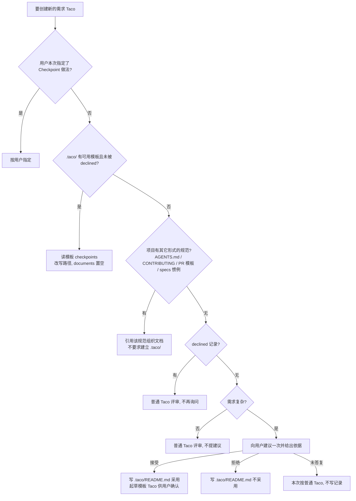

## 1. 背景与问题

Taco 已经具备 Checkpoints（阶段 DAG、文档状态表、每份文档的 `instruction`），但 Agent 写 Taco 时不会主动参考项目里的 Checkpoint 规范；项目没有规范时，也没有人提出要不要建立。每次需求要产出哪些文档、每份文档的硬性要求，全凭会话临场判断。

原提案（新建 `taco-checkpoints` skill、`.taco/checkpoints.json` 第二份 schema、AGENTS.md 受管段落与字节幂等接线）已在 2026-10-02 用户评审中否决：Checkpoint 是 Taco 的固有能力，不需要独立的 skill、schema 与初始化流程。本设计只在现有 `skills/taco/` 上做简短扩展。

现状证据：

| 位置 | 现状 | 与本需求的关系 |
| --- | --- | --- |
| `skills/taco/SKILL.md:24-28` | 已写「先用用户指令与项目自有模板或评审策略」「按评审契约决定是否用 Checkpoints」，但没有说**到哪里找**项目规范，也没有「无规范时怎么办」 | 在此处补发现顺序与一次性建议规则 |
| `skills/taco/references/checkpoints.md` | 只描述 `checkpoints` 结构、状态与 `instruction` | 新增「项目 Checkpoint 规范」一节，承载细则 |
| `src/model.ts:146` | `parseBundle` 只要求 `files` 是数组，可为空 | 空 Taco 模板（`files: []`）可正常加载 |
| `src/file-browser.ts:685-688` | `files: []` 时显示正常页面与「此 Taco 不包含文件」提示，不进 Recovery | 模板打开后不会被误判为损坏 |
| `packages/protocol/src/checkpoints.ts:144-146, 184-185` | `checkpoints.documents` 必须是数组（可为 `[]`）；文档路径必须安全且在 `root/` 内 | 模板与派生 Taco 都必须带 `documents: []`，路径需按新 `root` 改写 |
| `src/navigation.ts:63-74`、`src/file-browser.ts:606-616, 1018-1025` | 未创建的 Checkpoint 文档显示为占位行；占位行同样显示 `Instruction` 标签页 | 验收 2「未创建的文档显示为占位」由现有运行时满足，无需改运行时 |
| `src/file-browser.ts:1101-1102`、`src/checkpoint-view.ts:186-217`；`specs/009-*/spec.md:27` | `Instruction` 内容只读写入；Checkpoint 卡片只能改状态；Spec 009 明确不在 Taco 界面编辑 Checkpoint 定义 | 与 Issue「人可在浏览器编辑 instruction」不符，见待决策点 D1 |
| `skills/taco/SKILL.md:175`、`references/output-path.md:64`、`scripts/pack.mjs:152-153` | 打包内置排除隐藏路径与所有 `*.taco.html` | `.taco/` 下的模板与记录不会被打进需求 Taco |
| `skills/taco/scripts/checkpoints.mjs` | 对任意 `.taco.html` 输出 `nodes`、`documents`（含 `instruction`）、`frontier` | 新会话可直接用它读模板回答「产出哪些文档 / 硬性要求 / 下一步」 |
| `specs/014-agent-taco-output-path/spec.md:31` | 已否决 `.taco/config.yaml` 一类项目级配置 | 本设计的 `.taco/` 只放说明文件与模板 Taco，不引入配置 schema |
| `.gitignore` | 不忽略 `.taco/` | 决定记录与模板默认随仓库提交 |

## 2. 目标与非目标

### 2.1 目标

1. 写 Taco 前，Agent 按固定顺序发现项目已有的 Checkpoint 规范并遵循。
2. 项目有 `.taco/` 模板 Taco 时，Agent 只取其 `checkpoints` 定义，按本次 `root` 改写路径，生成状态表为空的新 Taco；写每份文档前满足对应 `instruction`。
3. 项目无规范、无记录且需求复杂时，Agent 向用户提出**一次**项目级建议并说明依据；用户答复后立即在 `.taco/README.md` 记录决定，此后所有会话不再询问。
4. 简单修改不提建议，不强制产出整套 spec/plan/tasks。
5. 增量简短：`SKILL.md` 增量 ≤ 2 KB，细则放 `references/checkpoints.md`。

### 2.2 非目标

- 不新建 skill 目录；不引入 `.taco/checkpoints.json` 或任何第二份 schema；不引入 `{feature}` 占位符语法。
- 不改 Taco 运行时的渲染与数据模型（`src/`、`packages/protocol/`、shell 均不动）。
- 不做 AGENTS.md 受管段落与字节幂等接线。
- 不改 `extensions/taco/skills/taco-speckit/`、`packages/cli/src/skills.ts` 内嵌指南；不强制安装 Spec Kit 扩展。
- 不新增脚本或 CLI 能力；路径改写由 Agent 按规则直接完成。
- 不做云端/协作相关能力。

## 3. 方案总览



### 3.1 规范发现顺序

写**新**需求 Taco 之前，Agent 按以下顺序取第一条命中的来源。项目根 = 向上找到 `.git` 目录或 `gitdir:` 文件所在目录（与 `references/output-path.md` 的仓库识别一致）；仓库内有多个 `.taco/` 时取最靠近工作目录的一份，并在报告中写明。

1. **用户本次指令**：用户明确要求或禁止使用 Checkpoint、指定图结构。
2. **`.taco/` 目录下的模板 Taco 与决定记录**（`.taco/README.md`）：
   - `decision: adopted` 且 `templates` 列出的模板可用 → 按 §3.2 使用；多份模板按 README 说明的适用场景选择，无法判断时询问用户（这是选模板，不是重新询问是否采用）。
   - 有模板但无记录（或记录未列出）→ 模板本身就是项目规范（Issue 明列「`.taco/` 下的模板 Taco」为来源之一），按 §3.2 使用，并在报告中提示补充决定记录。
   - `decision: declined` → 即便 `.taco/` 下存在模板也不套用（记录优先于文件存在），向用户提示一次冲突。它只关闭「建立建议」（第 5 步），不覆盖第 3 步的既有项目约定；本次文档组织继续走第 3 步。
   - `adopted` 但模板缺失或无法解析 → 报告问题，不自动重建模板、不重新提建议；本次继续走第 3 步，无其它约定时按普通 Taco 评审。
   - 记录无法识别（`decision` 缺失或取值未知）→ 报告，按普通 Taco 评审，不改写记录。
3. **项目其它形式的流程约定**：`AGENTS.md`/`CLAUDE.md` 等 Agent 规则文件、`CONTRIBUTING*`、`.github/pull_request_template.md`、`.specify/`（Spec Kit）、`specs/` 或 `docs/adr/` 的既有目录惯例。命中时引用该约定决定本次文档集合与评审顺序，并在报告中写明依据（文件与行）；不要求迁移到 `.taco/`，不提建立模板的建议。
4. **`declined` 记录**（第 2、3 步均未命中时）：按普通 Taco 评审，不再提建议，无论需求复杂度。
5. **无规范、无记录**：按 §3.3 判断是否提建议。

冲突处理：`.taco/` 模板与第 3 类来源对同一需求给出不同文档集合时，不静默选择一方，向用户指出冲突并按用户答复执行（该答复不写入决定记录，除非用户要求改变决定）。

刷新既有 Taco 时不重新套用模板：沿用 `SKILL.md` 刷新规则，完整保留既有 `checkpoints` 定义与状态表；既有 Taco 没有 `checkpoints` 时不自动补图，除非用户要求。

### 3.2 有模板时：只取定义，不复制运行时

生成新需求 Taco 的步骤（全部是对数据块的直接编辑，不需要脚本）：

1. 读取模板 `.taco.html` 的 `#taco-document` 数据块，先校验 `checkpoints` 定义完整：`version` 为 1、`nodes[].id` 唯一、`after` 只引用存在的 id 且无环、文档路径安全（无 `..`、无重复）且都以模板 `root/` 开头、`documents` 是数组。等价于对模板 `root` 跑一遍 `validateCheckpoints` 的完整规则；`parseBundle` 不校验 `checkpoints`，不能只看它通过。任一不满足即视为模板损坏，停止并报告，不猜测改写。
2. 只取 `checkpoints.nodes`；忽略模板的外壳、`docId`、`title`、`files`、`comments`、`navigation` 与 `checkpoints.documents`。
3. 路径改写：对每个 `nodes[].documents[].path`，去掉模板 `root/` 前缀，再接上本次 `root/`。例如模板 `root: "feature"`、`feature/plan.md`，本次 `root: "specs/018-search"` → `specs/018-search/plan.md`。改写后对新 `root` 重跑第 1 步的校验（安全、前缀、无重复）。
4. `id`、`title`、`after`、`optional`、`instruction` 原样保留；`checkpoints.version` 取 `1`；`checkpoints.template` 写模板的 `title`，便于追溯来源；`checkpoints.documents` 置为 `[]`，不继承任何状态记录。
5. 用当前 skill 的外壳（遵循 `SKILL.md`「Locate the shell」的变体选择）重新打包；本次目录中尚不存在的文档由运行时显示为占位行。
6. 写或修改任一 Checkpoint 文档前，先读其 `instruction` 并满足；用 `frontier` 建议下一步（沿用 `references/checkpoints.md` 既有规则：frontier 是建议，不是门禁）。
7. **简单修改的边界**：模板定义的是需求文档集合，不要求一次写完。本次任务只需其中 1 份（或 0 份）时，只做本次文档，其余节点留在图里当占位，不强写整套 spec/plan/tasks（Linear 2026-09-29 评论：「支持不使用模板或按小任务少做」）；本次若没有任何需求文档可打包（如单文件修订），按普通 Taco 评审单个文档，不套需求图（`SKILL.md:28` 的防误植原则）。这两种情况都不再询问是否采用。

新会话回答验收 5 的三个问题，只需对模板或已生成的需求 Taco 运行 `node <skill>/scripts/checkpoints.mjs <file.taco.html>`（或直接解析数据块）：`nodes[].documents[].path` = 要产出的文档；`documents[].instruction` = 硬性要求；`frontier` = 下一步可做的节点。

### 3.3 无规范时：按复杂度建议一次

**提建议的条件**（同时满足）：

- 当前目录位于某个仓库内（项目级记录需要落点；不在仓库内则不提建议）；
- 发现顺序第 2～4 步均未命中（无 `.taco/` 模板或可用记录、无项目约定、无 `declined` 记录）；
- 本次需求具备至少一项复杂信号：需要 2 份及以上存在先后依赖的文档（如先方案后计划）、需要多阶段评审、或需要跨角色确认（如产品与开发分别签字）。

单文件修订、文案修改、直接的缺陷修复不提建议，也不为它们生成 spec/plan/tasks 整套文档。这与 `SKILL.md:26`「按评审契约而不是任务标签或文档数量决定是否用 Checkpoints」不冲突：复杂信号只决定**是否向用户提出项目级建议**；本次需求 Taco 是否带 `checkpoints` 仍由评审契约与用户答复决定。

**建议的内容**：一次提问，写明依据（命中哪项复杂信号、查过哪些位置未发现规范）、采用后会写入哪些文件（`.taco/README.md` 与一个模板 Taco）、拒绝后会写入什么（仅 `.taco/README.md`），并说明以后不会再问、改主意可编辑或删除该文件。同一会话内最多提一次。

**答复处理**：

| 用户答复 | Agent 行为 |
| --- | --- |
| 接受 | 立即写 `.taco/README.md`（`decision: adopted`）；依据仓库证据起草模板 Taco 的节点、文档与 `instruction`，按 §4.1 写入 `.taco/`，交给用户评审；用户确认模板前，本次需求可先按草案生成 |
| 拒绝 | 立即写 `.taco/README.md`（`decision: declined`）；本次按普通 Taco 评审 |
| 未答复 / 含糊 | 不写记录；本次按普通 Taco 评审；之后会话遇到复杂需求可再提 |

Agent 只写文件，不替用户提交；在报告中提示「随仓库提交后团队与后续会话共享」。没有用户同意不改 `AGENTS.md` 等项目级流程文件（见待决策点 D2）。

改变决定：用户直接编辑或删除 `.taco/README.md`。删除后回到「无记录」状态；用户在会话中明确表示改主意时，Agent 按其意思改写记录。

## 4. 文件约定（契约）

两个文件都只是**说明与用法**，不是新 schema；运行时不读取它们。

### 4.1 模板 Taco

- 位置：`.taco/<文件名>.taco.html`，文件名 stem 为模板标题的规范化结果（与 `references/output-path.md` 的文件名规则一致），例如标题 `Feature Checkpoints` → `.taco/Feature_Checkpoints.taco.html`。写入属于用户确认后的显式指定（输出级联 L0）；`.taco/` 不是 `SKILL.md` 禁写清单里的「template 目录」（那指 skill/扩展自带的模板包）。
- 外壳：默认 Lite（约 186 KB，对比 Complete 约 2.7 MB）；用户要求离线可用时用 Complete。
- 数据块形态：

```json
{
  "format": "taco/files",
  "version": 1,
  "docId": "<新生成的 UUID>",
  "title": "Feature Checkpoints",
  "root": "feature",
  "files": [],
  "checkpoints": {
    "version": 1,
    "template": "Feature Checkpoints",
    "nodes": [
      {
        "id": "spec",
        "title": "需求说明",
        "after": [],
        "documents": [
          { "path": "feature/spec.md", "instruction": "必须包含目标、非目标与可验证的验收条件" }
        ]
      },
      {
        "id": "plan",
        "title": "实现方案",
        "after": ["spec"],
        "documents": [
          { "path": "feature/plan.md", "instruction": "列出受影响组件、契约变更与验证方案" },
          { "path": "feature/data-model.md", "optional": true }
        ]
      }
    ],
    "documents": []
  }
}
```

约束：`root` 必须是安全的非空相对路径（`isSafePath` 定义在 `src/model.ts:124-128`，root 校验在 `src/model.ts:145`，`.` 不可作 `root`），建议固定为 `feature`；文件路径校验在 `src/model.ts:156`，Checkpoint 文档路径校验在 `packages/protocol/src/checkpoints.ts:184-185`（安全且在 `root/` 内）；`documents` 必须存在且为 `[]`（`checkpoints.ts:144-146`）；`files` 为 `[]`。示例中的节点名与 `instruction` 只是形态示意，真实模板由 Agent 依据仓库证据起草、用户确认。

模板打开后：浏览器显示「此 Taco 不包含文件」与置顶的 Checkpoints 入口；Checkpoints 页展示 DAG 与占位卡片，选中占位行可在右侧 `Instruction` 标签页查看要求（只读，见 D1）。

### 4.2 决定记录 `.taco/README.md`

采用 YAML frontmatter + 简短正文（与仓库「新 Taco Markdown 用 frontmatter」的惯例一致，也让 Agent 不必解析自然语言）：

```markdown
---
decision: adopted        # adopted | declined
decided: 2026-10-02      # 用户答复当天，YYYY-MM-DD
templates:               # 仅 adopted 时出现；相对 .taco/ 的文件名
  - Feature_Checkpoints.taco.html
---

## Taco Checkpoint 决定

用户答复原话或理由：「……」

需求较复杂时，用上面的模板生成需求 Taco：只取其 checkpoints 定义，按本次目录改写文档路径，状态表置空。
改变决定：直接编辑本文件，或删除它以恢复「未决定」状态。
```

读取规则：只认 `decision` 字段的 `adopted`/`declined`；字段缺失或取值未知时视为「记录无法识别」，向用户报告并按普通 Taco 评审，**不**重新提建议、不改写该文件。`templates` 有多项时，正文应说明各自适用场景；Agent 无法据此选择时询问用户（这是选模板，不是重新询问是否采用）。`adopted` 但列出的模板文件缺失或无法解析时，报告问题后继续按 §3.1 第 3 步查找项目其它约定；无其它约定时本次按普通 Taco 评审。两种情形都不自动重建模板、不重新提建议。

## 5. 受影响组件

| 文件 | 变更 | 预计增量 |
| --- | --- | --- |
| `skills/taco/SKILL.md` | 在「Optional document and Checkpoint examples」节补一段「项目 Checkpoint 规范」：发现顺序四步、有模板时只取定义、无规范按复杂度建议一次并记录到 `.taco/README.md`、详见 reference。同时把 `:24` 的「project-owned templates or review policy」指向这一段，不重复表述 | +1.0～1.6 KB |
| `skills/taco/references/checkpoints.md` | 新增「Project Checkpoint convention」一节：§3.1 发现顺序与冲突处理、§3.2 路径改写与状态置空、§3.3 复杂信号与答复表、§4 两个文件的形态与读取规则 | +3.0～4.0 KB |
| `docs/agent-installation.md:51` | 一句话补充：项目可在 `.taco/` 记录 Checkpoint 决定与模板，skill 会先读取 | +0.1～0.2 KB |
| `packages/host/`（官网） | 实现阶段按 `AGENTS.md`「Skill & Website Review Sync」检查是否有描述 skill Checkpoint 行为的文案；有则同步并提供本地预览 | 待实现阶段核对 |

不受影响：运行时 `src/`、`packages/protocol/`、两种外壳及其镜像、`extensions/taco/`（含 `taco-speckit` skill 与模板包）、`packages/cli/src/skills.ts` 内嵌指南、`scripts/pack.mjs`、`scripts/checkpoints.mjs`。

## 6. 迁移与兼容

- **已有 Taco**：数据格式不变；刷新规则不变，既有 `checkpoints` 定义与状态表完整保留，不因模板出现而改写。
- **无 `.taco/` 的项目**：行为只多一步「发现」；简单修改的流程与今天完全一致。
- **Spec Kit 项目**：`.specify/` 属于第 3 类「其它形式的规范」，扩展自身约定继续决定路径与流程；不提建立 `.taco/` 的建议。
- **打包隔离**：`.taco/` 是隐藏路径，模板本身又是 `*.taco.html`，两条内置排除规则都使其不会进入需求 Taco；即使打包整个仓库根（输出级联 L2）也不会混入。
- **旧版 skill**：读不到新规则的旧版 skill 会忽略 `.taco/`，不会损坏任何文件；`.taco/README.md` 对人可读，团队仍能手动遵循。
- **与 Spec 014 的关系**：Spec 014 否决的是控制**输出位置**的项目级配置；`.taco/` 只承载 Checkpoint 决定说明与模板，不影响输出级联。

## 7. 体积与依赖估算（prepare 阶段）

| 产物 | 基线（本分支实测） | 预计增量 |
| --- | --- | --- |
| `skills/taco/SKILL.md` | 33,402 B | +1,000～1,600 B（约 +3%～+5%），满足 Issue「≲ 1–2 KB」 |
| `skills/taco/references/checkpoints.md` | 5,220 B | +3,000～4,000 B |
| `docs/agent-installation.md` | — | +100～200 B |
| `skills/taco/` 目录合计 | 13,820 KiB（`du -sk`） | +4～6 KB（< 0.05%） |
| `skills/taco/taco-shell.html` / `taco-shell-lite.html` | 2,735,870 B / 186,575 B | 0 B |
| `extensions/taco/assets/`、`dist-single/` 外壳 | — | 0 B |
| 发布产物（`taco-extension-*.zip`、`dist-single/` 构建产物、`taco-cli` 内嵌指南） | — | 0 B；skill 目录以安装/复制方式分发，随本次改动 +4～6 KB |

不引入新依赖，不新增联网行为。用户项目内的模板 Taco 默认 Lite，每个约 187 KB（随 skill 外壳版本变化）；属于用户项目文件，不计入 Taco 发布产物。实现阶段按同一口径用 `wc -c` 与 `du -sk` 实测并与上表并列记录。

## 8. 验收条件对应

| Issue 验收条件 | 设计条目 | 验证（§9） |
| --- | --- | --- |
| 1. 现有 taco skill 增加的说明简短（SKILL.md 增量 ≲ 1–2 KB），不新增 skill 目录 | §2.1-5、§5、§7 | V-size |
| 2. 有 `.taco/` 模板时：新 Taco 采用模板 DAG、路径落在新 `root` 内、状态表为空、未创建文档显示为占位；写文档前遵循 `instruction` | §3.1-2、§3.2、§4.1 | S1、V-tmpl |
| 3. 有其它形式规范（无 `.taco/`）时：引用该规范组织文档，不要求建立 `.taco/` | §3.1-3、§6 Spec Kit | S2 |
| 4. 无规范无记录 + 复杂需求：提出建议与依据，未确认不建模板；答复后出现记录；之后新会话不再询问（拒绝 → 普通评审；采用 → 按模板，简单修改只写本次需要的文档，见 §3.2-7）；无规范 + 简单修改：不提建议 | §3.3、§4.2 | S3～S7、S15～S17 |
| 5. 新会话仅凭 skill 与项目内模板，能回答产出哪些文档、硬性要求、下一步节点 | §3.2 末段 | S8 |

## 9. 验证方案

本特性只改 skill 文本，可观察行为是「新 Agent 会话读完 skill 后做什么」。验证以**场景化会话试验**为主，产物检查为辅；不新增针对 skill 文案的永久测试（那会把措辞钉死）。

**夹具**：在 `tmp/taco-34-fixtures/`（已被 `.gitignore` 忽略）建立若干最小 git 仓库，每个仓库附一段需求描述。

| 编号 | 夹具 | 需求 | 期望 |
| --- | --- | --- | --- |
| S1 | `.taco/README.md`（adopted）+ 一个 Lite 模板 Taco（2～3 个节点、含 `instruction` 与 `optional`） | 复杂需求 | 新 Taco 的 `checkpoints.nodes` 与模板一致，路径前缀为新 `root`，`documents: []`，`template` 为模板标题；已写文档满足对应 `instruction`；未写文档为占位 |
| S2 | 无 `.taco/`，`CONTRIBUTING.md` 规定「先 design.md 再 rollout.md」 | 复杂需求 | 按该约定组织并在报告中引用文件与行；不提建立 `.taco/` |
| S3 | 无规范、无记录 | 复杂需求，用户答「接受」 | 先提一次建议并给依据；答复前未创建任何 `.taco/` 文件；答复后出现 `decision: adopted` 记录与模板草案 |
| S4 | 同 S3 | 复杂需求，用户答「拒绝」 | 出现 `decision: declined` 记录；本次普通 Taco，无 `checkpoints` |
| S5 | S4 产出的仓库，新会话 | 复杂需求 | 不再询问，普通 Taco |
| S6 | S3 产出的仓库，新会话 | 简单修改 | 不再询问。分两种结果：本次涉及模板文档 → 只写本次需要的文档，其余节点留占位；本次不涉及需求文档（如单文件修订）→ 按普通 Taco 评审单个文档，不套需求图 |
| S7 | 无规范、无记录 | 简单修改（单文件文案） | 不提建议，不写 `.taco/` |
| S8 | S1 夹具，新会话 | 提问「这个需求要产出哪些文档、硬性要求、下一步做哪个」 | 答案与 `checkpoints.mjs` 输出的 `documents`/`instruction`/`frontier` 一致 |
| S9 | 嵌套 monorepo：`packages/a/` 内有自己的 `.taco/`，仓库根无 | 在 `packages/a` 下提复杂需求 | 用最靠近工作目录的 `.taco/`，报告中写明来源目录 |
| S10 | 同一 `.taco/` 两份模板 + README 注明适用场景 | 各提一次需求 | 按 README 场景选择；无法判断时询问（选模板，不是重新询问是否采用） |
| S11 | README 的 `decision` 取值非法 | 复杂需求 | 报告「记录无法识别」，按普通 Taco 评审，不改写 README，不重新提议 |
| S12 | 模板里有 `feature/../outside.md` 或重复路径 | 复杂需求 | 判定模板损坏，停止并报告，不猜测改写 |
| S13 | 既有需求 Taco 已有 `checkpoints` 且状态表非空，模板已更新 | 刷新该 Taco | 定义与状态表原样保留，不重新套用模板 |
| S14 | worktree：主检出之外的 `gitdir:` 工作树，工作树内有自己的 `.taco/` | 在工作树内提复杂需求 | 项目根识别命中 `gitdir:`；使用工作树内的 `.taco/`，报告写明来源目录 |
| S15 | 非仓库目录（无 `.git`），无任何规范 | 复杂需求 | 不提建议、不写 `.taco/`，按普通 Taco 评审 |
| S16 | S3 夹具处于「用户未答复」状态的仓库，新会话 | 复杂需求 | 未创建任何记录；允许再提一次建议（仍限每会话一次） |
| S17 | `declined` 记录与 `CONTRIBUTING.md` 流程约定共存 | 复杂需求 | 不套模板；按 CONTRIBUTING 约定组织文档并在报告中引用文件与行；不再提建议 |

执行方式：每个场景启动一个只加载 `skills/taco/`（实现后的版本）的全新子 Agent，输入需求描述；对 S3/S4 由测试者扮演用户答复。记录每个场景的 Agent 提问原文与产出文件。

**产物检查**：

- V-tmpl：模板与 S1 产物都要通过两层校验——`parseBundle` 与对各自 `root` 的 `validateCheckpoints` 完整规则（`resolveCheckpoints`/`checkpoints.mjs` 对没有 `checkpoints` 的 bundle 也返回 `valid: true`，不能只看这个标志）。随后运行 `node skills/taco/scripts/checkpoints.mjs <file>`，断言：`nodes` 数量与模板一致、路径前缀为新 `root/`、`checkpoints.documents` 为 `[]` 且 `status` 全为 `todo`/无 `updatedAt`、`checkpoints.template` 为模板标题、`frontier` 为模板入口节点；S1 夹具自身要求每条 required 文档带非空 `instruction`（协议允许缺省，此处是夹具断言）。在浏览器打开 S1 产物，确认占位行与 `Instruction` 标签页可见。
- V-size：`wc -c skills/taco/SKILL.md skills/taco/references/checkpoints.md` 与 §7 基线对比，`SKILL.md` 增量 ≤ 2,048 B；`find skills -maxdepth 1 -type d` 仍只有 `skills/taco`。
- 回归：`npm test`（含 `tests/skill-pack.test.ts` 对 `SKILL.md` 关键引用的检查、`tests/templates.test.ts` 镜像检查）全部通过。

## 10. 实现任务

1. 在 `skills/taco/references/checkpoints.md` 新增「Project Checkpoint convention」一节（§3、§4 的规则与两个文件的形态）。
2. 在 `skills/taco/SKILL.md` 的「Optional document and Checkpoint examples」节加入简短段落并链接上节；调整 `:24` 措辞避免重复。按 D1、D2 的最终决定调整相应措辞。
3. `docs/agent-installation.md:51` 补一句话。
4. 检查 `packages/host/` 是否描述了相关 skill 行为；有则同步并启动本地预览。
5. 搭建 `tmp/taco-34-fixtures/` 并执行 S1～S17、V-tmpl、V-size、`npm test`；把结果与体积实测写入本文件 §7 与 PR 描述。
6. 构建并提供可在浏览器打开的 S1 产物 Taco 作为可验证交付物（`AGENTS.md` 要求）。

## 11. 待决策点

### D1：模板里的 `instruction` 由谁、在哪里编辑

- **问题**：Issue 写「人可以直接在浏览器 Checkpoints 页查看和编辑 instruction」，同时把「改 Taco 运行时的渲染与数据模型」列为范围外。
- **背景**：当前运行时 `Instruction` 内容为只读写入（`src/file-browser.ts:1101-1102`），Checkpoint 卡片只能改状态（`src/checkpoint-view.ts:186-217`）；Spec 009 明确不在 Taco 界面编辑 Checkpoint 定义。两条要求在本特性范围内无法同时满足。
- **选项与取舍**：
  - A. **浏览器只读查看，编辑通过 Agent**：人在浏览器读 `instruction`，在模板 Taco 上留评论或直接告诉 Agent，由 Agent 改数据块。不改运行时，与范围外一致；代价是人不能自助改字。
  - B. **另开 Issue 做浏览器内编辑 `instruction`**：本特性按 A 交付，新 Issue 设计运行时编辑（涉及 Spec 009 边界、Handoff 新增定义变更通道）。体验最好，但需要单独设计与评审。
  - C. **本特性内顺带支持浏览器编辑**：违反 Issue 的范围外条目，并推翻 Spec 009 的既有边界；不推荐。
- **推荐**：A（必要时再走 B）。理由：与 Issue 范围外条目及 Spec 009 一致，验收条件 1～5 都不依赖浏览器编辑。
- **影响面**：`SKILL.md`/`checkpoints.md` 中对模板编辑方式的措辞；是否新增 Linear Issue。
- **不作决策时的默认行为**：按 A 撰写（文档写「浏览器查看，修改请交给 Agent 或用评论提出」），并在 PR 描述与交付说明中明确标注「浏览器内编辑 `instruction`」未实现、与 Issue 原文的「可编辑」存在冲突，需产品确认是否拆出运行时编辑 Issue；不得声称该能力已具备。

### D2：采用模板时是否在 `AGENTS.md` 加一行指向 `.taco/`

- **问题**：发现入口只在 taco skill 被触发时生效。未加载 taco skill 的会话（例如普通编码会话顺手写设计文档）看不到 `.taco/`。
- **背景**：Issue 将此列为「待确认」，并要求没有用户同意不改项目级流程文件、不做受管段落与幂等机制。
- **选项与取舍**：
  - A. **不加**：完全依赖 taco skill 触发。改动最少；代价是未加载 skill 的会话不会遵循模板。
  - B. **在采用建议的同一次提问中附带询问**：用户接受模板时一并问「是否在 AGENTS.md 加一行提示」，同意才追加一行普通文本（不加标记、不做幂等；已存在相同含义的行则不重复追加）。覆盖面更广；代价是建议提问多一个选项。
  - C. **采用即自动加**：违反「没有用户同意不改项目级流程文件」；不推荐。
- **推荐**：B。理由：仍是一次提问，不增加打扰次数；用户明确同意后才改流程文件；不引入受管段落。
- **影响面**：§3.3 建议内容与答复表；`checkpoints.md` 增量约 +200 B。
- **不作决策时的默认行为**：按 A 实现，不触碰 `AGENTS.md`。
